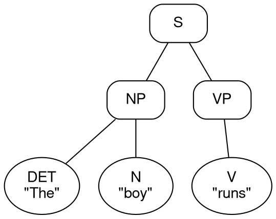

# C++17 English Parse Tree Compiler - Project Documentation

## 1. Project Overview
This project presents a high-performance, custom-built compiler written in modern C++17. Its primary function is to perform deep grammatical analysis and parsing of English sentences as well as standard arithmetic expressions. It processes raw string input through a sophisticated lexical analyzer, constructs an Abstract Syntax Tree (AST) using two distinct algorithmic parsing strategies, and renders the result directly in the terminal as a structured 2D ASCII format. 

By unifying both Top-Down (Recursive Descent) and Bottom-Up (Shift-Reduce) parsing methodologies within a single codebase, this project effectively demonstrates a deep understanding of compiler design, context-free grammars (CFG), and syntax tree generation.

---


## 2. Build & Execution Instructions

### Compilation Requirements
This compiler is written strictly in C++17 and relies on standard libraries. No external C++ dependencies (e.g., Boost) are required.

To compile the project from the source code, use a C++17 compatible compiler (e.g., `g++` or `clang++`):
```bash
g++ -std=c++17 src/*.cpp -Iinclude -o english-parser
```

### Execution
The compiled executable requires a string input and supports optional flags for altering the parsing strategy or exporting the Abstract Syntax Tree.
```bash
# Default Top-Down Parsing
./english-parser "The quick brown fox jumps"

# Force Bottom-Up (Shift-Reduce) Parsing
./english-parser --bottom-up "A girl reads a book"

# Export the AST to Graphviz DOT format for graphical rendering
./english-parser --dot tree.dot "The dog barks"
```

## 3. Core Functionalities & Features

### Lexical Analysis (Tokenizer)
The compiler features a custom-built Lexer that sanitizes and breaks down input strings into a sequence of discrete `Token` objects. It assigns grammatical Parts of Speech (POS) by cross-referencing a large, built-in dictionary file. When an unknown word is encountered, the Lexer utilizes fallback suffix heuristics (e.g., recognizing "-ing" as verbs, "-ly" as adverbs, and "-ed" as past-tense verbs).

### Dual Parsing Strategies
The engine implements two completely distinct parsing algorithms that achieve identical AST parity:
1. **Top-Down Parsing (Recursive Descent):** A predictive parser that processes Context-Free Grammar (CFG) rules with robust backtracking mechanisms to handle grammatical ambiguities.
2. **Bottom-Up Parsing (Shift-Reduce):** A deterministic shift-reduce automaton that uses custom 1-token and 2-token lookahead logic to effectively resolve shift-reduce conflicts typical in natural language (such as distinguishing between a subordinate clause boundary and a compound object).

### Data Structures & Visualization
The Abstract Syntax Tree is stored as an N-ary tree utilizing smart pointers (`std::unique_ptr`) to ensure memory safety. The AST can be visualized in two ways:
*   **Terminal ASCII:** A meticulously formatted 2D tree using box-drawing characters for immediate terminal feedback.
*   **Graphviz Export:** The parser can output the tree into the standard `.dot` format, allowing for high-resolution graphical rendering (PNG, PDF, SVG).

### Grammar Symbol Table
Post-parsing, the engine traverses the AST to generate a Symbol Table. This table maps every word in the sentence to its token index, Lexeme, Parts of Speech tag, precise Grammatical Role (e.g., `NP.head`, `VP.modifier`), and its syntactic Scope.

### Arithmetic Expression Parsing
Beyond natural language, the compiler integrates mathematical parsing. It evaluates standard arithmetic expressions (addition, subtraction, multiplication, division, and parentheses) and honors strict mathematical operator precedence using dedicated expression grammar rules.

---

## 4. System Pipeline & Data Flow

Before analyzing the raw C++ implementation, it is essential to understand the compiler's linear data flow:
1. **Input:** The system receives a raw English sentence or mathematical expression as a string.
2. **Lexical Analysis:** The `Lexer` iterates through the string, removing punctuation, handling contractions, and consulting the `pos_dict` (Parts of Speech Dictionary) to produce a `std::vector<Token>`.
3. **Parsing:** The selected engine (`TopDownParser` or `BottomUpParser`) consumes the tokens sequentially. Applying Context-Free Grammar rules, it constructs an N-ary Abstract Syntax Tree composed of `ParseNode` objects.
4. **Symbol Table Generation:** The `SymbolTable` class traverses the AST post-generation to deduce the grammatical role of every terminal node.
5. **Visualization:** The `Display` class recursively traverses the AST to print a formatted 2D ASCII structure directly to the terminal.

---

## 5. Complete Source Code

The following section contains the full, unabridged source code for the entire compiler. This encompasses the Lexer, Top-Down Parser, Bottom-Up Parser, Symbol Table generator, and ASCII display logic.

### `include/bottom_up_parser.h`

**Description:** Defines the interface for the Shift-Reduce (Bottom-Up) parsing algorithm, detailing the stack structure and lookahead mechanisms used to construct the AST.

```cpp
#pragma once
#include "lexer.h"
#include "parse_tree.h"
#include <vector>
#include <memory>
#include <string>

struct StackItem {
    std::unique_ptr<ParseNode> node;
    std::string symbol;
};

class BottomUpParser {
public:
    explicit BottomUpParser(const std::vector<Token>& tokens);
    std::unique_ptr<ParseNode> parse();

private:
    std::vector<Token> tokens_;
    size_t input_pos_;
    std::vector<StackItem> stack_;

    void shift();
    bool try_reduce();
    bool reduce_NP();
    bool reduce_VP();
    bool reduce_PP();
    bool reduce_S();
    
    bool stack_top_matches(const std::vector<std::string>& pattern) const;
    bool at_end() const;
};
```

### `include/display.h`

**Description:** Declares the utility functions responsible for formatting and rendering the Abstract Syntax Tree.

```cpp
#pragma once
#include "parse_tree.h"
#include "symbol_table.h"
#include <string>
#include <vector>

class Display {
public:
    static void print_tree(const ParseNode* root);
    static void print_strategy(const std::string& name);
    static void print_symbol_table(const SymbolTable& table);
    static void export_dot(const ParseNode* root, const std::string& filename);

private:
    static std::vector<std::string> render_tree_2d(const ParseNode* node);
    static void export_dot_node(const ParseNode* node, int& id_counter, std::ofstream& out);
};
```

### `include/lexer.h`

**Description:** Defines the `Token` structure and the `Lexer` class interface responsible for the lexical analysis phase.

```cpp
#pragma once
#include "pos_dict.h"
#include <string>
#include <vector>

struct Token {
    std::string word;
    POS tag;
    int position;
};

class Lexer {
public:
    explicit Lexer(const std::string& input);
    std::vector<Token> tokenize();

private:
    std::string input_;
    std::vector<std::string> split_words(const std::string& s);
    POS assign_pos(const std::string& word, bool is_first_word);
};
```

### `include/parse_tree.h`

**Description:** Defines the core `ParseNode` data structure, representing a single node (terminal or non-terminal) in the N-ary Abstract Syntax Tree.

```cpp
#pragma once
#include <string>
#include <vector>
#include <memory>

enum class NodeType { TERMINAL, NON_TERMINAL };

struct ParseNode {
    std::string label;
    std::string lexeme;
    NodeType type;
    std::vector<std::unique_ptr<ParseNode>> children;

    void add_child(std::unique_ptr<ParseNode> child);
    bool is_leaf() const { return type == NodeType::TERMINAL; }
};
```

### `include/pos_dict.h`

**Description:** Declares the enumeration for Parts of Speech (POS) tags and the interface for the global dictionary lookup system.

```cpp
#pragma once
#include <string>

enum class POS {
    DET, N, V, ADJ, ADV, PREP, PRON, CONJ, AUX, NUM, PROPER_N, OP, LPAREN, RPAREN, INTJ, UNKNOWN
};

std::string pos_to_str(POS tag);
POS str_to_pos(const std::string& s);
void load_dictionary(const std::string& filename);
POS lookup_word(const std::string& word);
```

### `include/symbol_table.h`

**Description:** Defines the `SymbolTable` class interface, designed to map AST tokens to their specific grammatical functions within the sentence.

```cpp
#pragma once
#include "parse_tree.h"
#include <string>
#include <vector>

struct SymbolEntry {
    int index;
    std::string lexeme;
    std::string pos_tag;
    std::string grammar_role;
    std::string scope;
};

class SymbolTable {
public:
    void build(const ParseNode* root);
    void print() const;
    const std::vector<SymbolEntry>& entries() const;

private:
    std::vector<SymbolEntry> entries_;
    int counter_ = 1;
    void traverse(const ParseNode* node, const std::string& parent_label, const std::string& scope);
};
```

### `include/top_down_parser.h`

**Description:** Declares the interface for the Recursive Descent (Top-Down) parser, outlining the recursive functions corresponding to the CFG rules.

```cpp
#pragma once
#include "lexer.h"
#include "parse_tree.h"
#include <vector>
#include <memory>

class TopDownParser {
public:
    explicit TopDownParser(const std::vector<Token>& tokens);
    std::unique_ptr<ParseNode> parse();

private:
    std::vector<Token> tokens_;
    size_t cursor_;

    std::unique_ptr<ParseNode> parse_S();
    std::unique_ptr<ParseNode> parse_S_base();
    std::unique_ptr<ParseNode> parse_NP();
    std::unique_ptr<ParseNode> parse_VP();
    std::unique_ptr<ParseNode> parse_PP();
    std::unique_ptr<ParseNode> parse_ADJ_list();

    std::unique_ptr<ParseNode> parse_EXPR();
    std::unique_ptr<ParseNode> parse_TERM();
    std::unique_ptr<ParseNode> parse_FACTOR();

    const Token& current() const;
    const Token& peek(int offset = 0) const;
    bool consume(POS expected, ParseNode* parent);
    bool at_end() const;
};
```

### `src/bottom_up_parser.cpp`

**Description:** Implements the deterministic Bottom-Up parsing logic. It processes tokens by shifting them onto a stack and reducing them according to CFG rules, utilizing custom lookahead logic to resolve complex shift-reduce conflicts.

```cpp
#include "bottom_up_parser.h"
#include <algorithm>
#include <iostream>

BottomUpParser::BottomUpParser(const std::vector<Token>& tokens) 
    : tokens_(tokens), input_pos_(0) {}

bool BottomUpParser::at_end() const {
    return input_pos_ >= tokens_.size();
}

std::unique_ptr<ParseNode> BottomUpParser::parse() {
    input_pos_ = 0;
    stack_.clear();
    
    int loop_counter = 0;
    int max_loops = tokens_.size() * 10;

    while (loop_counter++ < max_loops) {
        if (stack_.size() == 1 && stack_.back().symbol == "S" && at_end()) {
            return std::move(stack_.back().node);
        }

        if (try_reduce()) {
            std::cout << "Reduced: " << stack_.back().symbol << " (Stack size: " << stack_.size() << ")";
            if (stack_.back().node) {
                 std::cout << " Node labels: ";
                 for (const auto& child : stack_.back().node->children) {
                     std::cout << child->label << " ";
                 }
            }
            std::cout << std::endl;
            continue;
        } else if (!at_end()) {
            shift();
            std::cout << "Shifted: " << stack_.back().symbol << " (" << stack_.back().node->lexeme << ")" << std::endl;
        } else {
            // Stuck: Cannot shift and cannot reduce, but not in accept state
            // One last check: can we reduce S S to S or NP S to S?
            return nullptr;
        }
    }
    
    return nullptr; // Infinite loop guard triggered
}

void BottomUpParser::shift() {
    if (at_end()) return;

    auto& token = tokens_[input_pos_++];
    auto node = std::make_unique<ParseNode>();
    
    node->label = pos_to_str(token.tag);
    node->lexeme = token.word;
    node->type = NodeType::TERMINAL;
    
    stack_.push_back({std::move(node), pos_to_str(token.tag)});
}

bool BottomUpParser::stack_top_matches(const std::vector<std::string>& pattern) const {
    if (stack_.size() < pattern.size()) return false;
    
    size_t stack_idx = stack_.size() - pattern.size();
    for (size_t i = 0; i < pattern.size(); ++i) {
        if (stack_[stack_idx + i].symbol != pattern[i]) {
            return false;
        }
    }
    return true;
}

bool BottomUpParser::try_reduce() {
    // 1. Always reduce Prepositional Phrases first
    if (reduce_PP()) return true;

    // 2. Lookahead Conflict Resolution
    if (!at_end()) {
        std::string next_tag = pos_to_str(tokens_[input_pos_].tag);

        // Conflict: VP -> ADJ vs. ADJ CONJ ADJ
        if (stack_top_matches({"ADJ"}) || stack_top_matches({"AUX", "ADJ"})) {
            if (next_tag == "N" || next_tag == "ADJ") return false; // SHIFT
            if (next_tag == "CONJ") {
                // Peek ahead 1 to see if it's an ADJ
                if (input_pos_ + 1 < tokens_.size()) {
                    std::string next_next = pos_to_str(tokens_[input_pos_ + 1].tag);
                    if (next_next == "ADJ") return false; // SHIFT
                }
            }
        }

        // Conflict: NP -> V N vs. S -> NP VP (where V is the start of VP)
        if (stack_top_matches({"V", "N"})) {
            if (stack_.size() >= 3) {
                std::string prev = stack_[stack_.size() - 3].symbol;
                if (prev == "NP" || prev == "PRON" || prev == "AUX" || prev == "ADV" || prev == "PREP" || prev == "CONJ") {
                    if (next_tag == "PREP" || next_tag == "ADV" || next_tag == "EOF") return false;
                    if (next_tag == "CONJ") {
                        if (input_pos_ + 1 < tokens_.size()) {
                            std::string next_next = pos_to_str(tokens_[input_pos_ + 1].tag);
                            if (next_next != "PRON") return false;
                        } else {
                            return false;
                        }
                    }
                }
            }
        }
        
        // Conflict: S -> NP VP vs. VP -> VP PP / VP ADV / CONJ S S
        if (stack_top_matches({"NP", "VP"})) {
            // Check if the next token is a CONJ that functions as a PREP
            bool next_is_prep = false;
            if (next_tag == "CONJ") {
                const auto& next_token = tokens_[input_pos_];
                if (next_token.word == "before" || next_token.word == "after" || next_token.word == "until" || next_token.word == "since") {
                    next_is_prep = true;
                }
            }

            // CRITICAL FIX: If we are inside a CONJ S S structure (e.g., "Although you were late..."),
            // we MUST reduce NP VP to S immediately, even if the next token is a PRON ("you").
            bool inside_complex = false;
            if (stack_.size() >= 3 && (stack_[stack_.size()-3].symbol == "CONJ" || stack_[stack_.size()-3].symbol == "PRON")) inside_complex = true;
            
            if (!inside_complex) {
                // Not inside a CONJ block? Apply standard relative-clause lookahead delays.
                if (next_tag == "PRON" || next_tag == "ADV" || next_tag == "PREP") {
                    if (!next_is_prep) return false;
                }
                if (next_tag == "CONJ") {
                    // Only shift CONJ if we suspect it's coordinating verbs or object NPs.
                    // But if it's NP VP CONJ, it's safer to reduce to S, UNLESS we are in an auxiliary inversion?
                    // Actually, S CONJ S is standard.
                }
                
                // Conflict: S -> NP VP vs. S -> S NP (Time/Location NP at end)
                if (next_tag == "DET" || next_tag == "ADJ" || next_tag == "N" || next_tag == "PRON" || next_tag == "PROPER_N") {
                     // Check if this might be a time NP at the end of the sentence
                     // We check if after this NP we are at end
                     // In BU we only know the next token. If we see a DET/N, we might want to SHIFT 
                     // to build a trailing NP for the whole sentence.
                     return false; 
                }
            }
        }
        
        // General verb modifiers: wait for objects/adverbs
        if (stack_top_matches({"V"}) || stack_top_matches({"AUX", "V"})) {
            if (next_tag == "DET" || next_tag == "ADJ" || next_tag == "N" || next_tag == "PROPER_N" || 
                next_tag == "PRON" || next_tag == "ADV" || next_tag == "PREP") {
                return false; // SHIFT to build longer VP
            }
        }
        // Conflict: S -> CONJ S vs. S -> CONJ S S
        if (stack_top_matches({"CONJ", "S"})) {
             if (!at_end()) {
                  auto next_tag = pos_to_str(tokens_[input_pos_].tag);
                  // If the next token can start an S (NP elements), wait!
                  if (next_tag == "PRON" || next_tag == "DET" || next_tag == "N" || next_tag == "PROPER_N" || next_tag == "ADJ" || next_tag == "ADV" || next_tag == "AUX") {
                       return false; // SHIFT
                  }
             }
        }

    }

    // 3. Perform reductions if no lookahead conflicts forced a shift
    if (reduce_NP()) return true;
    if (reduce_VP()) return true;
    if (reduce_S()) return true;

    return false;
}

bool BottomUpParser::reduce_PP() {
    if (stack_top_matches({"PREP", "NP"})) {
        auto node = std::make_unique<ParseNode>();
        node->label = "PP";
        node->type = NodeType::NON_TERMINAL;
        
        auto np = std::move(stack_.back().node); stack_.pop_back();
        auto prep = std::move(stack_.back().node); stack_.pop_back();
        
        node->add_child(std::move(prep));
        node->add_child(std::move(np));
        
        stack_.push_back({std::move(node), "PP"});
        return true;
    }
    return false;
}

bool BottomUpParser::reduce_NP() {
    if (stack_top_matches({"DET", "ADJ", "CONJ", "ADJ", "N"})) {
        auto node = std::make_unique<ParseNode>();
        node->label = "NP";
        node->type = NodeType::NON_TERMINAL;
        auto n = std::move(stack_.back().node); stack_.pop_back();
        auto adj2 = std::move(stack_.back().node); stack_.pop_back();
        auto conj = std::move(stack_.back().node); stack_.pop_back();
        auto adj1 = std::move(stack_.back().node); stack_.pop_back();
        auto det = std::move(stack_.back().node); stack_.pop_back();
        node->add_child(std::move(det));
        node->add_child(std::move(adj1));
        node->add_child(std::move(conj));
        node->add_child(std::move(adj2));
        node->add_child(std::move(n));
        stack_.push_back({std::move(node), "NP"});
        return true;
    }
    if (stack_top_matches({"NP", "PRON", "S"})) {
        auto node = std::make_unique<ParseNode>();
        node->label = "NP"; node->type = NodeType::NON_TERMINAL;
        auto s_node = std::move(stack_.back().node); stack_.pop_back();
        auto pron = std::move(stack_.back().node); stack_.pop_back();
        auto np = std::move(stack_.back().node); stack_.pop_back();
        node->add_child(std::move(np));
        node->add_child(std::move(pron));
        node->add_child(std::move(s_node));
        stack_.push_back({std::move(node), "NP"});
        return true;
    }
    if (stack_top_matches({"NP", "PRON", "VP"})) {
        auto node = std::make_unique<ParseNode>();
        node->label = "NP"; node->type = NodeType::NON_TERMINAL;
        auto vp = std::move(stack_.back().node); stack_.pop_back();
        auto pron = std::move(stack_.back().node); stack_.pop_back();
        auto np = std::move(stack_.back().node); stack_.pop_back();
        node->add_child(std::move(np));
        node->add_child(std::move(pron));
        node->add_child(std::move(vp));
        stack_.push_back({std::move(node), "NP"});
        return true;
    }
    
    if (stack_top_matches({"NP", "CONJ", "NP"})) {
        if (stack_[stack_.size()-2].node->lexeme == "and" || stack_[stack_.size()-2].node->lexeme == "or") {
            auto node = std::make_unique<ParseNode>();
            node->label = "NP"; node->type = NodeType::NON_TERMINAL;
            auto np2 = std::move(stack_.back().node); stack_.pop_back();
            auto conj = std::move(stack_.back().node); stack_.pop_back();
            auto np1 = std::move(stack_.back().node); stack_.pop_back();
            node->add_child(std::move(np1));
            node->add_child(std::move(conj));
            node->add_child(std::move(np2));
            stack_.push_back({std::move(node), "NP"});
            return true;
        }
    }

    if (stack_top_matches({"NP", "PP"})) {
        auto node = std::make_unique<ParseNode>();
        node->label = "NP";
        node->type = NodeType::NON_TERMINAL;
        auto pp = std::move(stack_.back().node); stack_.pop_back();
        auto np = std::move(stack_.back().node); stack_.pop_back();
        node->add_child(std::move(np));
        node->add_child(std::move(pp));
        stack_.push_back({std::move(node), "NP"});
        return true;
    }

    if (stack_top_matches({"DET", "NUM", "ADJ", "N"})) {
        auto node = std::make_unique<ParseNode>();
        node->label = "NP";
        node->type = NodeType::NON_TERMINAL;
        auto n = std::move(stack_.back().node); stack_.pop_back();
        auto adj = std::move(stack_.back().node); stack_.pop_back();
        auto num = std::move(stack_.back().node); stack_.pop_back();
        auto det = std::move(stack_.back().node); stack_.pop_back();
        node->add_child(std::move(det));
        node->add_child(std::move(num));
        node->add_child(std::move(adj));
        node->add_child(std::move(n));
        stack_.push_back({std::move(node), "NP"});
        return true;
    }
    if (stack_top_matches({"DET", "ADJ", "ADJ", "N"})) {
        auto node = std::make_unique<ParseNode>();
        node->label = "NP";
        node->type = NodeType::NON_TERMINAL;
        auto n = std::move(stack_.back().node); stack_.pop_back();
        auto adj2 = std::move(stack_.back().node); stack_.pop_back();
        auto adj1 = std::move(stack_.back().node); stack_.pop_back();
        auto det = std::move(stack_.back().node); stack_.pop_back();
        node->add_child(std::move(det));
        node->add_child(std::move(adj1));
        node->add_child(std::move(adj2));
        node->add_child(std::move(n));
        stack_.push_back({std::move(node), "NP"});
        return true;
    }


    if (stack_top_matches({"DET", "DET", "N"})) {
        auto node = std::make_unique<ParseNode>();
        node->label = "NP";
        node->type = NodeType::NON_TERMINAL;
        auto n = std::move(stack_.back().node); stack_.pop_back();
        auto det2 = std::move(stack_.back().node); stack_.pop_back();
        auto det1 = std::move(stack_.back().node); stack_.pop_back();
        node->add_child(std::move(det1));
        node->add_child(std::move(det2));
        node->add_child(std::move(n));
        stack_.push_back({std::move(node), "NP"});
        return true;
    }
    if (stack_top_matches({"DET", "N", "N", "N"})) {
        auto node = std::make_unique<ParseNode>();
        node->label = "NP";
        node->type = NodeType::NON_TERMINAL;
        auto n3 = std::move(stack_.back().node); stack_.pop_back();
        auto n2 = std::move(stack_.back().node); stack_.pop_back();
        auto n1 = std::move(stack_.back().node); stack_.pop_back();
        auto det = std::move(stack_.back().node); stack_.pop_back();
        node->add_child(std::move(det));
        node->add_child(std::move(n1));
        node->add_child(std::move(n2));
        node->add_child(std::move(n3));
        stack_.push_back({std::move(node), "NP"});
        return true;
    }

    if (stack_top_matches({"DET", "V", "N", "N"})) {
        auto node = std::make_unique<ParseNode>();
        node->label = "NP";
        node->type = NodeType::NON_TERMINAL;
        auto n2 = std::move(stack_.back().node); stack_.pop_back();
        auto n1 = std::move(stack_.back().node); stack_.pop_back();
        auto v = std::move(stack_.back().node); stack_.pop_back();
        auto det = std::move(stack_.back().node); stack_.pop_back();
        node->add_child(std::move(det));
        node->add_child(std::move(v));
        node->add_child(std::move(n1));
        node->add_child(std::move(n2));
        stack_.push_back({std::move(node), "NP"});
        return true;
    }

    if (stack_top_matches({"DET", "ADJ", "ADJ", "N"})) {
        auto node = std::make_unique<ParseNode>();
        node->label = "NP";
        node->type = NodeType::NON_TERMINAL;
        auto n = std::move(stack_.back().node); stack_.pop_back();
        auto adj2 = std::move(stack_.back().node); stack_.pop_back();
        auto adj1 = std::move(stack_.back().node); stack_.pop_back();
        auto det = std::move(stack_.back().node); stack_.pop_back();
        node->add_child(std::move(det));
        node->add_child(std::move(adj1));
        node->add_child(std::move(adj2));
        node->add_child(std::move(n));
        stack_.push_back({std::move(node), "NP"});
        return true;
    }

    if (stack_top_matches({"DET", "DET", "N"})) {
        auto node = std::make_unique<ParseNode>();
        node->label = "NP";
        node->type = NodeType::NON_TERMINAL;
        auto n = std::move(stack_.back().node); stack_.pop_back();
        auto det2 = std::move(stack_.back().node); stack_.pop_back();
        auto det1 = std::move(stack_.back().node); stack_.pop_back();
        node->add_child(std::move(det1));
        node->add_child(std::move(det2));
        node->add_child(std::move(n));
        stack_.push_back({std::move(node), "NP"});
        return true;
    }
    if (stack_top_matches({"DET", "NUM", "N"})) {
        auto node = std::make_unique<ParseNode>();
        node->label = "NP";
        node->type = NodeType::NON_TERMINAL;
        auto n = std::move(stack_.back().node); stack_.pop_back();
        auto num = std::move(stack_.back().node); stack_.pop_back();
        auto det = std::move(stack_.back().node); stack_.pop_back();
        node->add_child(std::move(det));
        node->add_child(std::move(num));
        node->add_child(std::move(n));
        stack_.push_back({std::move(node), "NP"});
        return true;
    }

    if (stack_top_matches({"DET", "V", "N"})) {
        if (!at_end() && pos_to_str(tokens_[input_pos_].tag) == "N") {
            // Do not eagerly reduce, allow DET V N N to match
        } else {
            auto node = std::make_unique<ParseNode>();
            node->label = "NP";
            node->type = NodeType::NON_TERMINAL;
            auto n = std::move(stack_.back().node); stack_.pop_back();
            auto v = std::move(stack_.back().node); stack_.pop_back();
            auto det = std::move(stack_.back().node); stack_.pop_back();
            node->add_child(std::move(det));
            node->add_child(std::move(v));
            node->add_child(std::move(n));
            stack_.push_back({std::move(node), "NP"});
            return true;
        }
    }

    if (stack_top_matches({"DET", "ADJ", "N"})) {
        auto node = std::make_unique<ParseNode>();
        node->label = "NP";
        node->type = NodeType::NON_TERMINAL;
        auto n = std::move(stack_.back().node); stack_.pop_back();
        auto adj = std::move(stack_.back().node); stack_.pop_back();
        auto det = std::move(stack_.back().node); stack_.pop_back();
        node->add_child(std::move(det));
        node->add_child(std::move(adj));
        node->add_child(std::move(n));
        stack_.push_back({std::move(node), "NP"});
        return true;
    }

    if (stack_top_matches({"DET", "N", "N"})) {
        auto node = std::make_unique<ParseNode>();
        node->label = "NP";
        node->type = NodeType::NON_TERMINAL;
        auto n2 = std::move(stack_.back().node); stack_.pop_back();
        auto n1 = std::move(stack_.back().node); stack_.pop_back();
        auto det = std::move(stack_.back().node); stack_.pop_back();
        node->add_child(std::move(det));
        node->add_child(std::move(n1));
        node->add_child(std::move(n2));
        stack_.push_back({std::move(node), "NP"});
        return true;
    }
    if (stack_top_matches({"NUM", "ADJ", "N"})) {
        auto node = std::make_unique<ParseNode>();
        node->label = "NP";
        node->type = NodeType::NON_TERMINAL;
        auto n = std::move(stack_.back().node); stack_.pop_back();
        auto adj = std::move(stack_.back().node); stack_.pop_back();
        auto num = std::move(stack_.back().node); stack_.pop_back();
        node->add_child(std::move(num));
        node->add_child(std::move(adj));
        node->add_child(std::move(n));
        stack_.push_back({std::move(node), "NP"});
        return true;
    }

    if (stack_top_matches({"ADJ", "ADJ", "N"})) {
        auto node = std::make_unique<ParseNode>();
        node->label = "NP";
        node->type = NodeType::NON_TERMINAL;
        auto n = std::move(stack_.back().node); stack_.pop_back();
        auto adj2 = std::move(stack_.back().node); stack_.pop_back();
        auto adj1 = std::move(stack_.back().node); stack_.pop_back();
        node->add_child(std::move(adj1));
        node->add_child(std::move(adj2));
        node->add_child(std::move(n));
        stack_.push_back({std::move(node), "NP"});
        return true;
    }
    if (stack_top_matches({"DET", "N"})) {
        if (!at_end() && pos_to_str(tokens_[input_pos_].tag) == "N") return false;

        auto node = std::make_unique<ParseNode>();

        node->label = "NP";
        node->type = NodeType::NON_TERMINAL;
        auto n = std::move(stack_.back().node); stack_.pop_back();
        auto det = std::move(stack_.back().node); stack_.pop_back();
        node->add_child(std::move(det));
        node->add_child(std::move(n));
        stack_.push_back({std::move(node), "NP"});
        return true;
    }
    if (stack_top_matches({"NUM", "N"})) {
        auto node = std::make_unique<ParseNode>();
        node->label = "NP";
        node->type = NodeType::NON_TERMINAL;
        auto n = std::move(stack_.back().node); stack_.pop_back();
        auto num = std::move(stack_.back().node); stack_.pop_back();
        node->add_child(std::move(num));
        node->add_child(std::move(n));
        stack_.push_back({std::move(node), "NP"});
        return true;
    }

    if (stack_top_matches({"V", "N"})) {
        if (stack_.size() >= 3 && (stack_[stack_.size()-3].symbol == "NP" || stack_[stack_.size()-3].symbol == "AUX" || stack_[stack_.size()-3].symbol == "DET")) {
            // Do not reduce V N, let it be V NP
        } else {
            auto node = std::make_unique<ParseNode>();
            node->label = "NP";
            node->type = NodeType::NON_TERMINAL;
            auto n = std::move(stack_.back().node); stack_.pop_back();
            auto v = std::move(stack_.back().node); stack_.pop_back();
            node->add_child(std::move(v));
            node->add_child(std::move(n));
            stack_.push_back({std::move(node), "NP"});
            return true;
        }
    }

    if (stack_top_matches({"ADJ", "N"})) {
        auto node = std::make_unique<ParseNode>();
        node->label = "NP";
        node->type = NodeType::NON_TERMINAL;
        auto n = std::move(stack_.back().node); stack_.pop_back();
        auto adj = std::move(stack_.back().node); stack_.pop_back();
        node->add_child(std::move(adj));
        node->add_child(std::move(n));
        stack_.push_back({std::move(node), "NP"});
        return true;
    }
    if (stack_top_matches({"ADJ", "V"})) {
        auto node = std::make_unique<ParseNode>();
        node->label = "NP";
        node->type = NodeType::NON_TERMINAL;
        auto v = std::move(stack_.back().node); stack_.pop_back();
        auto adj = std::move(stack_.back().node); stack_.pop_back();
        node->add_child(std::move(adj));
        node->add_child(std::move(v));
        stack_.push_back({std::move(node), "NP"});
        return true;
    }
    if (stack_top_matches({"N", "N", "N"})) {
        auto node = std::make_unique<ParseNode>();
        node->label = "NP";
        node->type = NodeType::NON_TERMINAL;
        auto n3 = std::move(stack_.back().node); stack_.pop_back();
        auto n2 = std::move(stack_.back().node); stack_.pop_back();
        auto n1 = std::move(stack_.back().node); stack_.pop_back();
        node->add_child(std::move(n1));
        node->add_child(std::move(n2));
        node->add_child(std::move(n3));
        stack_.push_back({std::move(node), "NP"});
        return true;
    }
    if (stack_top_matches({"N", "N"})) {
        if (!at_end() && pos_to_str(tokens_[input_pos_].tag) == "N") return false;
        auto node = std::make_unique<ParseNode>();
        node->label = "NP";
        node->type = NodeType::NON_TERMINAL;
        auto n2 = std::move(stack_.back().node); stack_.pop_back();
        auto n1 = std::move(stack_.back().node); stack_.pop_back();
        node->add_child(std::move(n1));
        node->add_child(std::move(n2));
        stack_.push_back({std::move(node), "NP"});
        return true;
    }
    if (stack_top_matches({"V"})) {
        // Look ahead: if next is EOF or ADV, maybe it's S -> VP or VP -> V?
        // If it's DET V, it's definitely an NP (e.g. "the building")
        if (stack_.size() > 1 && stack_[stack_.size()-2].symbol == "DET") {
             auto node = std::make_unique<ParseNode>();
             node->label = "NP";
             node->type = NodeType::NON_TERMINAL;
             auto v = std::move(stack_.back().node); stack_.pop_back();
             node->add_child(std::move(v));
             stack_.push_back({std::move(node), "NP"});
             return true;
        }

        bool should_reduce_to_np = false;
        if (stack_.size() > 1 && stack_[stack_.size() - 2].symbol == "PREP") should_reduce_to_np = true;
        if (stack_.size() > 1 && stack_[stack_.size() - 2].symbol == "V") should_reduce_to_np = true;
        // DO NOT reduce V to NP if it's acting as a predicate in NP VP or if it's the start of a VP
        if (stack_.size() > 1 && (stack_[stack_.size()-2].symbol == "DET" || stack_[stack_.size()-2].symbol == "ADJ")) should_reduce_to_np = true;
        
        if (!at_end() && (pos_to_str(tokens_[input_pos_].tag) == "AUX" || pos_to_str(tokens_[input_pos_].tag) == "V")) should_reduce_to_np = true;
        
        // CRITICAL: Check if this is the start of a VP for a main clause NP.
        // If stack is [NP, V] and next is N/DET, it's likely a predicate.
        if (stack_.size() >= 2 && stack_[stack_.size()-2].symbol == "NP") {
             if (!at_end()) {
                 auto next_tag = pos_to_str(tokens_[input_pos_].tag);
                 if (next_tag == "DET" || next_tag == "N" || next_tag == "ADJ" || next_tag == "PRON" || next_tag == "ADV" || next_tag == "PREP" || next_tag == "V" || next_tag == "AUX") {
                     should_reduce_to_np = false;
                 }
             }
        }

        if (!at_end() && pos_to_str(tokens_[input_pos_].tag) == "N") should_reduce_to_np = false;
        
        if (should_reduce_to_np) {
            auto node = std::make_unique<ParseNode>();
            node->label = "NP";
            node->type = NodeType::NON_TERMINAL;
            auto v = std::move(stack_.back().node); stack_.pop_back();
            node->add_child(std::move(v));
            stack_.push_back({std::move(node), "NP"});
            return true;
        }
    }

    if (stack_top_matches({"NP", "PRON"})) {
         return false;
    }

    if (stack_top_matches({"PRON"})) {
        if (!at_end()) {
            auto next_tag = pos_to_str(tokens_[input_pos_].tag);
            // Allow immediate NP reduction if the next is a verb or auxiliary (Main Subject case)
            if (next_tag == "V" || next_tag == "AUX" || next_tag == "ADV") {
                // Keep moving
            } else if (next_tag == "N" || next_tag == "DET" || next_tag == "PREP" || next_tag == "CONJ" || next_tag == "PRON") {
                return false;
            }
        }
        auto node = std::make_unique<ParseNode>();
        node->label = "NP";
        node->type = NodeType::NON_TERMINAL;
        auto pron = std::move(stack_.back().node); stack_.pop_back();
        node->add_child(std::move(pron));
        stack_.push_back({std::move(node), "NP"});
        return true;
    }
    if (stack_top_matches({"PROPER_N"})) {
        if (!at_end()) {
            auto next_tag = pos_to_str(tokens_[input_pos_].tag);
            if (next_tag == "V" || next_tag == "AUX") {
                // Keep moving
            } else if (next_tag == "N" || next_tag == "DET" || next_tag == "ADV" || next_tag == "PREP" || next_tag == "CONJ" || next_tag == "PRON") {
                return false;
            }
        }
        auto node = std::make_unique<ParseNode>();
        node->label = "NP";
        node->type = NodeType::NON_TERMINAL;
        auto pn = std::move(stack_.back().node); stack_.pop_back();
        node->add_child(std::move(pn));
        stack_.push_back({std::move(node), "NP"});
        return true;
    }

    if (stack_top_matches({"N"})) {
        if (!at_end()) {
            auto next_tag = pos_to_str(tokens_[input_pos_].tag);
            if (next_tag == "V" || next_tag == "AUX") {
                // Keep moving
            } else if (next_tag == "N" || next_tag == "DET" || next_tag == "ADV" || next_tag == "PREP" || next_tag == "PRON") {
                return false;
            } else if (next_tag == "CONJ") {
                if (input_pos_ + 1 < tokens_.size()) {
                    auto next_next = pos_to_str(tokens_[input_pos_ + 1].tag);
                    if (next_next == "N" || next_next == "ADJ" || next_next == "DET" || next_next == "PROPER_N") {
                        return false;
                    }
                } else {
                    return false;
                }
            }
        }
        auto node = std::make_unique<ParseNode>();
        node->label = "NP";
        node->type = NodeType::NON_TERMINAL;
        auto n = std::move(stack_.back().node); stack_.pop_back();
        node->add_child(std::move(n));
        stack_.push_back({std::move(node), "NP"});
        return true;
    }
    return false;
}


bool BottomUpParser::reduce_VP() {

    if (stack_top_matches({"AUX", "ADJ", "CONJ", "ADJ"})) {
        auto node = std::make_unique<ParseNode>();
        node->label = "VP";
        node->type = NodeType::NON_TERMINAL;
        auto adj2 = std::move(stack_.back().node); stack_.pop_back();
        auto conj = std::move(stack_.back().node); stack_.pop_back();
        auto adj1 = std::move(stack_.back().node); stack_.pop_back();
        auto aux = std::move(stack_.back().node); stack_.pop_back();
        node->add_child(std::move(aux));
        node->add_child(std::move(adj1));
        node->add_child(std::move(conj));
        node->add_child(std::move(adj2));
        stack_.push_back({std::move(node), "VP"});
        return true;
    }
    if (stack_top_matches({"AUX", "PREP", "VP"})) {
        auto node = std::make_unique<ParseNode>();
        node->label = "VP";
        node->type = NodeType::NON_TERMINAL;
        auto vp = std::move(stack_.back().node); stack_.pop_back();
        auto prep = std::move(stack_.back().node); stack_.pop_back();
        auto aux = std::move(stack_.back().node); stack_.pop_back();
        node->add_child(std::move(aux));
        node->add_child(std::move(prep));
        node->add_child(std::move(vp));
        stack_.push_back({std::move(node), "VP"});
        return true;
    }
    if (stack_top_matches({"V", "PREP", "VP"})) {
        auto node = std::make_unique<ParseNode>();
        node->label = "VP";
        node->type = NodeType::NON_TERMINAL;
        auto vp = std::move(stack_.back().node); stack_.pop_back();
        auto prep = std::move(stack_.back().node); stack_.pop_back();
        auto v = std::move(stack_.back().node); stack_.pop_back();
        node->add_child(std::move(v));
        node->add_child(std::move(prep));
        node->add_child(std::move(vp));
        stack_.push_back({std::move(node), "VP"});
        return true;
    }
    if (stack_top_matches({"PREP", "VP"})) {
        auto node = std::make_unique<ParseNode>();
        node->label = "VP";
        node->type = NodeType::NON_TERMINAL;
        auto vp = std::move(stack_.back().node); stack_.pop_back();
        auto prep = std::move(stack_.back().node); stack_.pop_back();
        node->add_child(std::move(prep));
        node->add_child(std::move(vp));
        stack_.push_back({std::move(node), "VP"});
        return true;
    }
    if (stack_top_matches({"ADJ"})) {
        // Look ahead: if next is N, do NOT reduce ADJ to VP
        if (!at_end() && pos_to_str(tokens_[input_pos_].tag) == "N") return false;
        
        auto node = std::make_unique<ParseNode>();
        node->label = "VP";
        node->type = NodeType::NON_TERMINAL;
        auto adj = std::move(stack_.back().node); stack_.pop_back();
        node->add_child(std::move(adj));
        stack_.push_back({std::move(node), "VP"});
        return true;
    }
    if (stack_top_matches({"NP", "ADV", "VP"})) {
        auto node = std::make_unique<ParseNode>();
        node->label = "S";
        node->type = NodeType::NON_TERMINAL;
        auto vp = std::move(stack_.back().node); stack_.pop_back();
        auto adv = std::move(stack_.back().node); stack_.pop_back();
        auto np = std::move(stack_.back().node); stack_.pop_back();
        node->add_child(std::move(np));
        auto wrap_vp = std::make_unique<ParseNode>();
        wrap_vp->label = "VP"; wrap_vp->type = NodeType::NON_TERMINAL;
        wrap_vp->add_child(std::move(adv));
        wrap_vp->add_child(std::move(vp));
        node->add_child(std::move(wrap_vp));
        stack_.push_back({std::move(node), "S"});
        return true;
    }
    if (stack_top_matches({"ADV", "VP"})) {
        auto node = std::make_unique<ParseNode>();
        node->label = "VP";
        node->type = NodeType::NON_TERMINAL;
        auto vp = std::move(stack_.back().node); stack_.pop_back();
        auto adv = std::move(stack_.back().node); stack_.pop_back();
        node->add_child(std::move(adv));
        node->add_child(std::move(vp));
        stack_.push_back({std::move(node), "VP"});
        return true;
    }
    if (stack_top_matches({"VP", "ADV"})) {
        auto node = std::make_unique<ParseNode>();
        node->label = "VP";
        node->type = NodeType::NON_TERMINAL;
        auto adv = std::move(stack_.back().node); stack_.pop_back();
        auto vp = std::move(stack_.back().node); stack_.pop_back();
        node->add_child(std::move(vp));
        node->add_child(std::move(adv));
        stack_.push_back({std::move(node), "VP"});
        return true;
    }
    if (stack_top_matches({"VP", "PP"})) {
        auto node = std::make_unique<ParseNode>();
        node->label = "VP";
        node->type = NodeType::NON_TERMINAL;
        auto pp = std::move(stack_.back().node); stack_.pop_back();
        auto vp = std::move(stack_.back().node); stack_.pop_back();
        node->add_child(std::move(vp));
        node->add_child(std::move(pp));
        stack_.push_back({std::move(node), "VP"});
        return true;
    }
    if (stack_top_matches({"V", "PREP", "VP"})) {
        auto node = std::make_unique<ParseNode>();
        node->label = "VP";
        node->type = NodeType::NON_TERMINAL;
        auto vp = std::move(stack_.back().node); stack_.pop_back();
        auto prep = std::move(stack_.back().node); stack_.pop_back();
        auto v = std::move(stack_.back().node); stack_.pop_back();
        node->add_child(std::move(v));
        node->add_child(std::move(prep));
        node->add_child(std::move(vp));
        stack_.push_back({std::move(node), "VP"});
        return true;
    }
    if (stack_top_matches({"PREP", "VP"})) {
        auto node = std::make_unique<ParseNode>();
        node->label = "VP";
        node->type = NodeType::NON_TERMINAL;
        auto vp = std::move(stack_.back().node); stack_.pop_back();
        auto prep = std::move(stack_.back().node); stack_.pop_back();
        node->add_child(std::move(prep));
        node->add_child(std::move(vp));
        stack_.push_back({std::move(node), "VP"});
        return true;
    }
    if (stack_top_matches({"VP", "ADV"})) {
        auto node = std::make_unique<ParseNode>();
        node->label = "VP";
        node->type = NodeType::NON_TERMINAL;
        auto adv = std::move(stack_.back().node); stack_.pop_back();
        auto vp = std::move(stack_.back().node); stack_.pop_back();
        node->add_child(std::move(vp));
        node->add_child(std::move(adv));
        stack_.push_back({std::move(node), "VP"});
        return true;
    }
    if (stack_top_matches({"VP", "PP"})) {
        auto node = std::make_unique<ParseNode>();
        node->label = "VP";
        node->type = NodeType::NON_TERMINAL;
        auto pp = std::move(stack_.back().node); stack_.pop_back();
        auto vp = std::move(stack_.back().node); stack_.pop_back();
        node->add_child(std::move(vp));
        node->add_child(std::move(pp));
        stack_.push_back({std::move(node), "VP"});
        return true;
    }
    if (stack_top_matches({"AUX", "VP"})) {
        auto node = std::make_unique<ParseNode>();
        node->label = "VP";
        node->type = NodeType::NON_TERMINAL;
        auto vp = std::move(stack_.back().node); stack_.pop_back();
        auto aux = std::move(stack_.back().node); stack_.pop_back();
        node->add_child(std::move(aux));
        node->add_child(std::move(vp));
        stack_.push_back({std::move(node), "VP"});
        return true;
    }
    if (stack_top_matches({"AUX", "NP", "ADV"})) {
        auto node = std::make_unique<ParseNode>();
        node->label = "VP";
        node->type = NodeType::NON_TERMINAL;
        auto adv = std::move(stack_.back().node); stack_.pop_back();
        auto np = std::move(stack_.back().node); stack_.pop_back();
        auto aux = std::move(stack_.back().node); stack_.pop_back();
        node->add_child(std::move(aux));
        node->add_child(std::move(np));
        node->add_child(std::move(adv));
        stack_.push_back({std::move(node), "VP"});
        return true;
    }

    if (stack_top_matches({"AUX", "V", "NP", "ADV"})) {
        auto node = std::make_unique<ParseNode>();
        node->label = "VP";
        node->type = NodeType::NON_TERMINAL;
        auto adv = std::move(stack_.back().node); stack_.pop_back();
        auto np = std::move(stack_.back().node); stack_.pop_back();
        auto v = std::move(stack_.back().node); stack_.pop_back();
        auto aux = std::move(stack_.back().node); stack_.pop_back();
        node->add_child(std::move(aux));
        node->add_child(std::move(v));
        node->add_child(std::move(np));
        node->add_child(std::move(adv));
        stack_.push_back({std::move(node), "VP"});
        return true;
    }
    if (stack_top_matches({"AUX", "V", "NP", "PP"})) {
        auto node = std::make_unique<ParseNode>();
        node->label = "VP";
        node->type = NodeType::NON_TERMINAL;
        auto pp = std::move(stack_.back().node); stack_.pop_back();
        auto np = std::move(stack_.back().node); stack_.pop_back();
        auto v = std::move(stack_.back().node); stack_.pop_back();
        auto aux = std::move(stack_.back().node); stack_.pop_back();
        node->add_child(std::move(aux));
        node->add_child(std::move(v));
        node->add_child(std::move(np));
        node->add_child(std::move(pp));
        stack_.push_back({std::move(node), "VP"});
        return true;
    }
    if (stack_top_matches({"AUX", "V", "NP"})) {
        auto node = std::make_unique<ParseNode>();
        node->label = "VP";
        node->type = NodeType::NON_TERMINAL;
        auto np = std::move(stack_.back().node); stack_.pop_back();
        auto v = std::move(stack_.back().node); stack_.pop_back();
        auto aux = std::move(stack_.back().node); stack_.pop_back();
        node->add_child(std::move(aux));
        node->add_child(std::move(v));
        node->add_child(std::move(np));
        stack_.push_back({std::move(node), "VP"});
        return true;
    }
    if (stack_top_matches({"AUX", "V", "PP"})) {
        auto node = std::make_unique<ParseNode>();
        node->label = "VP";
        node->type = NodeType::NON_TERMINAL;
        auto pp = std::move(stack_.back().node); stack_.pop_back();
        auto v = std::move(stack_.back().node); stack_.pop_back();
        auto aux = std::move(stack_.back().node); stack_.pop_back();
        node->add_child(std::move(aux));
        node->add_child(std::move(v));
        node->add_child(std::move(pp));
        stack_.push_back({std::move(node), "VP"});
        return true;
    }
    if (stack_top_matches({"AUX", "V", "ADV"})) {
        auto node = std::make_unique<ParseNode>();
        node->label = "VP";
        node->type = NodeType::NON_TERMINAL;
        auto adv = std::move(stack_.back().node); stack_.pop_back();
        auto v = std::move(stack_.back().node); stack_.pop_back();
        auto aux = std::move(stack_.back().node); stack_.pop_back();
        
        auto inner_vp = std::make_unique<ParseNode>();
        inner_vp->label = "VP"; inner_vp->type = NodeType::NON_TERMINAL;
        
        auto innermost_vp = std::make_unique<ParseNode>();
        innermost_vp->label = "VP"; innermost_vp->type = NodeType::NON_TERMINAL;
        innermost_vp->add_child(std::move(v));
        
        inner_vp->add_child(std::move(innermost_vp));
        inner_vp->add_child(std::move(adv));
        
        node->add_child(std::move(aux));
        node->add_child(std::move(inner_vp));
        stack_.push_back({std::move(node), "VP"});
        return true;
    }
    if (stack_top_matches({"AUX", "ADV", "V"})) {
        auto node = std::make_unique<ParseNode>();
        node->label = "VP";
        node->type = NodeType::NON_TERMINAL;
        auto v = std::move(stack_.back().node); stack_.pop_back();
        auto adv = std::move(stack_.back().node); stack_.pop_back();
        auto aux = std::move(stack_.back().node); stack_.pop_back();
        node->add_child(std::move(aux));
        node->add_child(std::move(adv));
        node->add_child(std::move(v));
        stack_.push_back({std::move(node), "VP"});
        return true;
    }
    if (stack_top_matches({"AUX", "ADV"})) {
        auto node = std::make_unique<ParseNode>();
        node->label = "VP";
        node->type = NodeType::NON_TERMINAL;
        auto adv = std::move(stack_.back().node); stack_.pop_back();
        auto aux = std::move(stack_.back().node); stack_.pop_back();
        
        auto inner_vp = std::make_unique<ParseNode>();
        inner_vp->label = "VP"; inner_vp->type = NodeType::NON_TERMINAL;
        inner_vp->add_child(std::move(aux));
        
        node->add_child(std::move(inner_vp));
        node->add_child(std::move(adv));
        stack_.push_back({std::move(node), "VP"});
        return true;
    }
    if (stack_top_matches({"AUX", "V"})) {
        auto node = std::make_unique<ParseNode>();
        node->label = "VP";
        node->type = NodeType::NON_TERMINAL;
        auto v = std::move(stack_.back().node); stack_.pop_back();
        auto aux = std::move(stack_.back().node); stack_.pop_back();
        node->add_child(std::move(aux));
        node->add_child(std::move(v));
        stack_.push_back({std::move(node), "VP"});
        return true;
    }
    if (stack_top_matches({"AUX", "NP", "PP"})) {
        auto node = std::make_unique<ParseNode>();
        node->label = "VP";
        node->type = NodeType::NON_TERMINAL;
        auto pp = std::move(stack_.back().node); stack_.pop_back();
        auto np = std::move(stack_.back().node); stack_.pop_back();
        auto aux = std::move(stack_.back().node); stack_.pop_back();
        node->add_child(std::move(aux));
        node->add_child(std::move(np));
        node->add_child(std::move(pp));
        stack_.push_back({std::move(node), "VP"});
        return true;
    }
    if (stack_top_matches({"AUX", "NP", "ADV"})) {
        auto node = std::make_unique<ParseNode>();
        node->label = "VP";
        node->type = NodeType::NON_TERMINAL;
        auto adv = std::move(stack_.back().node); stack_.pop_back();
        auto np = std::move(stack_.back().node); stack_.pop_back();
        auto aux = std::move(stack_.back().node); stack_.pop_back();
        node->add_child(std::move(aux));
        node->add_child(std::move(np));
        node->add_child(std::move(adv));
        stack_.push_back({std::move(node), "VP"});
        return true;
    }
    if (stack_top_matches({"AUX", "NP"})) {
        auto node = std::make_unique<ParseNode>();
        node->label = "VP";
        node->type = NodeType::NON_TERMINAL;
        auto np = std::move(stack_.back().node); stack_.pop_back();
        auto aux = std::move(stack_.back().node); stack_.pop_back();
        node->add_child(std::move(aux));
        node->add_child(std::move(np));
        stack_.push_back({std::move(node), "VP"});
        return true;
    }
    if (stack_top_matches({"AUX", "PP"})) {
        auto node = std::make_unique<ParseNode>();
        node->label = "VP";
        node->type = NodeType::NON_TERMINAL;
        auto pp = std::move(stack_.back().node); stack_.pop_back();
        auto aux = std::move(stack_.back().node); stack_.pop_back();
        node->add_child(std::move(aux));
        node->add_child(std::move(pp));
        stack_.push_back({std::move(node), "VP"});
        return true;
    }
    if (stack_top_matches({"AUX", "ADJ"})) {
        auto node = std::make_unique<ParseNode>();
        node->label = "VP";
        node->type = NodeType::NON_TERMINAL;
        auto adj = std::move(stack_.back().node); stack_.pop_back();
        auto aux = std::move(stack_.back().node); stack_.pop_back();
        node->add_child(std::move(aux));
        node->add_child(std::move(adj));
        stack_.push_back({std::move(node), "VP"});
        return true;
    }
    if (stack_top_matches({"AUX", "VP"})) {
        auto node = std::make_unique<ParseNode>();
        node->label = "VP";
        node->type = NodeType::NON_TERMINAL;
        auto vp = std::move(stack_.back().node); stack_.pop_back();
        auto aux = std::move(stack_.back().node); stack_.pop_back();
        node->add_child(std::move(aux));
        node->add_child(std::move(vp));
        stack_.push_back({std::move(node), "VP"});
        return true;
    }
    if (stack_top_matches({"V", "NP", "PP"})) {
        auto node = std::make_unique<ParseNode>();
        node->label = "VP";
        node->type = NodeType::NON_TERMINAL;
        auto pp = std::move(stack_.back().node); stack_.pop_back();
        auto np = std::move(stack_.back().node); stack_.pop_back();
        auto v = std::move(stack_.back().node); stack_.pop_back();
        node->add_child(std::move(v));
        node->add_child(std::move(np));
        node->add_child(std::move(pp));
        stack_.push_back({std::move(node), "VP"});
        return true;
    }
    if (stack_top_matches({"V", "NP", "NP"})) {
        auto node = std::make_unique<ParseNode>();
        node->label = "VP";
        node->type = NodeType::NON_TERMINAL;
        auto np2 = std::move(stack_.back().node); stack_.pop_back();
        auto np1 = std::move(stack_.back().node); stack_.pop_back();
        auto v = std::move(stack_.back().node); stack_.pop_back();
        node->add_child(std::move(v));
        node->add_child(std::move(np1));
        node->add_child(std::move(np2));
        stack_.push_back({std::move(node), "VP"});
        return true;
    }
    if (stack_top_matches({"AUX", "NP", "NP"})) {
        auto node = std::make_unique<ParseNode>();
        node->label = "VP";
        node->type = NodeType::NON_TERMINAL;
        auto np2 = std::move(stack_.back().node); stack_.pop_back();
        auto np1 = std::move(stack_.back().node); stack_.pop_back();
        auto aux = std::move(stack_.back().node); stack_.pop_back();
        node->add_child(std::move(aux));
        node->add_child(std::move(np1));
        node->add_child(std::move(np2));
        stack_.push_back({std::move(node), "VP"});
        return true;
    }
    if (stack_top_matches({"V", "NP", "ADV"})) {
        auto node = std::make_unique<ParseNode>();
        node->label = "VP";
        node->type = NodeType::NON_TERMINAL;
        auto adv = std::move(stack_.back().node); stack_.pop_back();
        auto np = std::move(stack_.back().node); stack_.pop_back();
        auto v = std::move(stack_.back().node); stack_.pop_back();
        node->add_child(std::move(v));
        node->add_child(std::move(np));
        node->add_child(std::move(adv));
        stack_.push_back({std::move(node), "VP"});
        return true;
    }
    if (stack_top_matches({"V", "NP"})) {
        if (!at_end()) {
             auto next_tag = pos_to_str(tokens_[input_pos_].tag);
             if (next_tag == "PRON") return false;
             if (next_tag == "CONJ") {
                 // Check if it's coordinating two object NPs instead of clauses
                 // For example, "I like apples and oranges"
                 if (input_pos_ + 1 < tokens_.size()) {
                     auto next_next = pos_to_str(tokens_[input_pos_ + 1].tag);
                     if (next_next == "N" || next_next == "ADJ" || next_next == "DET" || next_next == "PROPER_N") {
                         // But wait, if it's "while the students", DET N can start an S!
                         // In that case, we want to reduce V NP to VP.
                         // But if it's just coordinating objects "the apple and the orange", we want to shift CONJ.
                         // So we have an ambiguity. TD parses it fine. BU can wait for "and" vs "while".
                         const auto& conj_word = tokens_[input_pos_].word;
                         if (conj_word == "and" || conj_word == "or" || conj_word == "nor") {
                             return false; // shift for coordinating objects
                         }
                     }
                 } else {
                     return false;
                 }
             }
             // If next is V, and it's a MAIN verb, we should reduce this VP now
             if (next_tag == "V") {
                int pron_count = 0;
                for (const auto& item : stack_) if (item.symbol == "PRON") pron_count++;
                int remaining_verbs = 0;
                for (size_t i = input_pos_; i < tokens_.size(); ++i) {
                    if (tokens_[i].tag == POS::V || tokens_[i].tag == POS::AUX) remaining_verbs++;
                }
                if (remaining_verbs >= pron_count && pron_count > 0) {
                    // Reduce now so NP PRON S can form
                } else {
                    return false; // Shift next V? Maybe "give students grades"? 
                }
             }
        }
        auto node = std::make_unique<ParseNode>();
        node->label = "VP";
        node->type = NodeType::NON_TERMINAL;
        auto np = std::move(stack_.back().node); stack_.pop_back();
        auto v = std::move(stack_.back().node); stack_.pop_back();
        node->add_child(std::move(v));
        node->add_child(std::move(np));
        stack_.push_back({std::move(node), "VP"});
        return true;
    }
    if (stack_top_matches({"V", "PP"})) {
        auto node = std::make_unique<ParseNode>();
        node->label = "VP";
        node->type = NodeType::NON_TERMINAL;
        auto pp = std::move(stack_.back().node); stack_.pop_back();
        auto v = std::move(stack_.back().node); stack_.pop_back();
        node->add_child(std::move(v));
        node->add_child(std::move(pp));
        stack_.push_back({std::move(node), "VP"});
        return true;
    }
    if (stack_top_matches({"V", "ADV"})) {
        auto node = std::make_unique<ParseNode>();
        node->label = "VP";
        node->type = NodeType::NON_TERMINAL;
        auto adv = std::move(stack_.back().node); stack_.pop_back();
        auto v = std::move(stack_.back().node); stack_.pop_back();
        
        auto inner_vp = std::make_unique<ParseNode>();
        inner_vp->label = "VP"; inner_vp->type = NodeType::NON_TERMINAL;
        inner_vp->add_child(std::move(v));
        
        node->add_child(std::move(inner_vp));
        node->add_child(std::move(adv));
        stack_.push_back({std::move(node), "VP"});
        return true;
    }
    if (stack_top_matches({"VP"})) {
        // If we have NP PRON VP, we MUST reduce VP to S
        if (stack_.size() >= 3 && stack_[stack_.size()-3].symbol == "NP" && stack_[stack_.size()-2].symbol == "PRON") {
             auto node = std::make_unique<ParseNode>();
             node->label = "S";
             node->type = NodeType::NON_TERMINAL;
             auto vp = std::move(stack_.back().node); stack_.pop_back();
             node->add_child(std::move(vp));
             stack_.push_back({std::move(node), "S"});
             return true;
        }
        return false;
    }

    if (stack_top_matches({"V"})) {
        // Shift if it's the start of the sentence and more tokens follow.
        // BUT wait, TD is doing S -> S S -> VP VP for "Dogs chase cats".
        // In BU, if we shift "Dogs", then shift "chase", then "cats", we get V V N.
        // If we reduce Cats to NP, we have V V NP.
        // If we reduce V NP to VP, we have V VP.
        // If we reduce V to VP, we have VP VP.
        // If we reduce VP to S, we have S VP.
        // If we reduce VP to S, we have S S.
        // Then S S to S.
        
        if (!at_end()) {
            auto next_tag = pos_to_str(tokens_[input_pos_].tag);
            // If next is a verb or NP components, keep shifting to allow longer structures
            if (next_tag == "V" || next_tag == "NP" || next_tag == "N" || next_tag == "DET" || next_tag == "ADJ" || next_tag == "PRON") {
                return false;
            }
        }
        // If it's a verb but sitting at the start of the stack, and there's a verb following, 
        // it might be better as an NP (gerund) OR we should wait and see if it's S -> VP S or S -> VP.
        // But the TD parser is choosing S -> S S -> VP VP.
        
        auto node = std::make_unique<ParseNode>();
        node->label = "VP";
        node->type = NodeType::NON_TERMINAL;
        auto v = std::move(stack_.back().node); stack_.pop_back();
        node->add_child(std::move(v));
        stack_.push_back({std::move(node), "VP"});
        return true;
    }
    return false;
}

bool BottomUpParser::reduce_S() {
    if (stack_top_matches({"NP", "VP"})) {
         if (!at_end()) {
             auto next_tag = pos_to_str(tokens_[input_pos_].tag);
             bool preceded_by_rel = (stack_.size() >= 3 && (stack_[stack_.size()-3].symbol == "PRON" || stack_[stack_.size()-3].symbol == "CONJ"));
             if (!preceded_by_rel) {
                 if (next_tag == "PRON") return false;
                 // Standard shift/reduce delay for main verbs
                 // BUT DO NOT delay if the next is an NP component and we are at stack depth 2
                 // as that likely indicates a trailing NP that should be handled by S -> S NP
                 if (stack_.size() == 2) {
                      // Reduce now, then trailing NP will be shifted and reduced to S -> S NP
                 } else {
                     if (next_tag == "V" || next_tag == "AUX" || next_tag == "ADV" || next_tag == "PREP") return false;
                 }
             }
         }
         auto node = std::make_unique<ParseNode>();
         node->label = "S";
         node->type = NodeType::NON_TERMINAL;
         auto vp = std::move(stack_.back().node); stack_.pop_back();
         auto np = std::move(stack_.back().node); stack_.pop_back();
         node->add_child(std::move(np));
         node->add_child(std::move(vp));
         stack_.push_back({std::move(node), "S"});
         return true;
    }
    
    if (stack_top_matches({"VP"})) {
        // If we have NP PRON VP or NP VP (and at end), we MUST reduce VP to S
        if (stack_.size() >= 3 && stack_[stack_.size()-3].symbol == "NP" && stack_[stack_.size()-2].symbol == "PRON") {
             auto node = std::make_unique<ParseNode>();
             node->label = "S";
             node->type = NodeType::NON_TERMINAL;
             auto vp = std::move(stack_.back().node); stack_.pop_back();
             node->add_child(std::move(vp));
             stack_.push_back({std::move(node), "S"});
             return true;
        }
        if (stack_.size() >= 2 && stack_[stack_.size()-2].symbol == "NP" && at_end()) {
             auto node = std::make_unique<ParseNode>();
             node->label = "S";
             node->type = NodeType::NON_TERMINAL;
             auto vp = std::move(stack_.back().node); stack_.pop_back();
             auto np = std::move(stack_.back().node); stack_.pop_back();
             node->add_child(std::move(np));
             node->add_child(std::move(vp));
             stack_.push_back({std::move(node), "S"});
             return true;
        }
        return false;
    }

    if (stack_top_matches({"NP", "VP", "AUX", "NP"})) {
        // Look ahead: if next is EOF, it's a tag question.
        if (at_end()) {
            auto node = std::make_unique<ParseNode>();
            node->label = "S";
            node->type = NodeType::NON_TERMINAL;
            auto np2 = std::move(stack_.back().node); stack_.pop_back();
            auto aux = std::move(stack_.back().node); stack_.pop_back();
            auto vp = std::move(stack_.back().node); stack_.pop_back();
            auto np1 = std::move(stack_.back().node); stack_.pop_back();
            node->add_child(std::move(np1));
            node->add_child(std::move(vp));
            node->add_child(std::move(aux));
            node->add_child(std::move(np2));
            stack_.push_back({std::move(node), "S"});
            return true;
        }
    }

    if (stack_top_matches({"S", "NP"})) {
         // ONLY reduce to S NP if it's the end of the sentence or following is another modifier.
         // Do not reduce if the preceding token was CONJ! S -> CONJ S S should be preferred.
         if (stack_.size() >= 3 && stack_[stack_.size()-3].symbol == "CONJ") return false;
         
         auto node = std::make_unique<ParseNode>();
         node->label = "S";
         node->type = NodeType::NON_TERMINAL;
         auto np = std::move(stack_.back().node); stack_.pop_back();
         auto s = std::move(stack_.back().node); stack_.pop_back();
         node->add_child(std::move(s));
         node->add_child(std::move(np));
         stack_.push_back({std::move(node), "S"});
         return true;
    }

    if (stack_top_matches({"S", "CONJ", "S"})) {
        auto node = std::make_unique<ParseNode>();
        node->label = "S"; node->type = NodeType::NON_TERMINAL;
        auto s2 = std::move(stack_.back().node); stack_.pop_back();
        auto conj = std::move(stack_.back().node); stack_.pop_back();
        auto s1 = std::move(stack_.back().node); stack_.pop_back();
        node->add_child(std::move(s1));
        node->add_child(std::move(conj));
        node->add_child(std::move(s2));
        stack_.push_back({std::move(node), "S"});
        return true;
    }

    if (stack_top_matches({"CONJ", "S", "S"})) {
        auto node = std::make_unique<ParseNode>();
        node->label = "S";
        node->type = NodeType::NON_TERMINAL;
        auto s2 = std::move(stack_.back().node); stack_.pop_back();
        auto s1 = std::move(stack_.back().node); stack_.pop_back();
        auto conj = std::move(stack_.back().node); stack_.pop_back();
        node->add_child(std::move(conj));
        node->add_child(std::move(s1));
        node->add_child(std::move(s2));
        stack_.push_back({std::move(node), "S"});
        return true;
    }

    if (stack_top_matches({"ADV", "S"})) {
        auto node = std::make_unique<ParseNode>();
        node->label = "S";
        node->type = NodeType::NON_TERMINAL;
        auto s = std::move(stack_.back().node); stack_.pop_back();
        auto adv = std::move(stack_.back().node); stack_.pop_back();
        node->add_child(std::move(adv));
        node->add_child(std::move(s));
        stack_.push_back({std::move(node), "S"});
        return true;
    }

    if (stack_top_matches({"AUX", "NP", "NP"})) {
        auto node = std::make_unique<ParseNode>();
        node->label = "S";
        node->type = NodeType::NON_TERMINAL;
        auto np2 = std::move(stack_.back().node); stack_.pop_back();
        auto np1 = std::move(stack_.back().node); stack_.pop_back();
        auto aux = std::move(stack_.back().node); stack_.pop_back();
        node->add_child(std::move(aux));
        node->add_child(std::move(np1));
        node->add_child(std::move(np2));
        stack_.push_back({std::move(node), "S"});
        return true;
    }

    if (stack_top_matches({"S", "S"})) {
        auto node = std::make_unique<ParseNode>();
        node->label = "S";
        node->type = NodeType::NON_TERMINAL;
        auto s2 = std::move(stack_.back().node); stack_.pop_back();
        auto s1 = std::move(stack_.back().node); stack_.pop_back();
        node->add_child(std::move(s1));
        node->add_child(std::move(s2));
        stack_.push_back({std::move(node), "S"});
        return true;
    }

    if (stack_top_matches({"S", "ADV"})) {
        auto node = std::make_unique<ParseNode>();
        node->label = "S";
        node->type = NodeType::NON_TERMINAL;
        auto adv = std::move(stack_.back().node); stack_.pop_back();
        auto s = std::move(stack_.back().node); stack_.pop_back();
        node->add_child(std::move(s));
        node->add_child(std::move(adv));
        stack_.push_back({std::move(node), "S"});
        return true;
    }

    if (stack_top_matches({"S", "PP"})) {
        auto node = std::make_unique<ParseNode>();
        node->label = "S";
        node->type = NodeType::NON_TERMINAL;
        auto pp = std::move(stack_.back().node); stack_.pop_back();
        auto s = std::move(stack_.back().node); stack_.pop_back();
        node->add_child(std::move(s));
        node->add_child(std::move(pp));
        stack_.push_back({std::move(node), "S"});
        return true;
    }

    if (stack_top_matches({"CONJ", "S"})) {
        auto node = std::make_unique<ParseNode>();
        node->label = "S";
        node->type = NodeType::NON_TERMINAL;
        auto s = std::move(stack_.back().node); stack_.pop_back();
        auto conj = std::move(stack_.back().node); stack_.pop_back();
        node->add_child(std::move(conj));
        node->add_child(std::move(s));
        stack_.push_back({std::move(node), "S"});
        return true;
    }

    if (stack_top_matches({"NP", "VP", "CONJ", "NP"})) {
        auto node = std::make_unique<ParseNode>();
        node->label = "S";
        node->type = NodeType::NON_TERMINAL;
        auto np2 = std::move(stack_.back().node); stack_.pop_back();
        auto conj = std::move(stack_.back().node); stack_.pop_back();
        auto vp = std::move(stack_.back().node); stack_.pop_back();
        auto np1 = std::move(stack_.back().node); stack_.pop_back();
        node->add_child(std::move(np1));
        node->add_child(std::move(vp));
        node->add_child(std::move(conj));
        node->add_child(std::move(np2));
        stack_.push_back({std::move(node), "S"});
        return true;
    }

    if (stack_top_matches({"NP", "AUX", "NP", "VP"})) {
        auto node = std::make_unique<ParseNode>();
        node->label = "S";
        node->type = NodeType::NON_TERMINAL;
        auto vp = std::move(stack_.back().node); stack_.pop_back();
        auto np2 = std::move(stack_.back().node); stack_.pop_back();
        auto aux = std::move(stack_.back().node); stack_.pop_back();
        auto np1 = std::move(stack_.back().node); stack_.pop_back();
        node->add_child(std::move(np1));
        node->add_child(std::move(aux));
        node->add_child(std::move(np2));
        node->add_child(std::move(vp));
        stack_.push_back({std::move(node), "S"});
        return true;
    }

    if (stack_top_matches({"NP", "VP", "PP"})) {
        auto node = std::make_unique<ParseNode>();
        node->label = "S";
        node->type = NodeType::NON_TERMINAL;
        auto pp = std::move(stack_.back().node); stack_.pop_back();
        auto vp = std::move(stack_.back().node); stack_.pop_back();
        auto np = std::move(stack_.back().node); stack_.pop_back();
        node->add_child(std::move(np));
        node->add_child(std::move(vp));
        node->add_child(std::move(pp));
        stack_.push_back({std::move(node), "S"});
        return true;
    }

    if (stack_top_matches({"AUX", "NP", "VP"})) {
        auto node = std::make_unique<ParseNode>();
        node->label = "S";
        node->type = NodeType::NON_TERMINAL;
        auto vp = std::move(stack_.back().node); stack_.pop_back();
        auto np = std::move(stack_.back().node); stack_.pop_back();
        auto aux = std::move(stack_.back().node); stack_.pop_back();
        node->add_child(std::move(aux));
        node->add_child(std::move(np));
        node->add_child(std::move(vp));
        stack_.push_back({std::move(node), "S"});
        return true;
    }

    if (stack_top_matches({"NP", "ADV", "VP"})) {
        auto node = std::make_unique<ParseNode>();
        node->label = "S";
        node->type = NodeType::NON_TERMINAL;
        auto vp = std::move(stack_.back().node); stack_.pop_back();
        auto adv = std::move(stack_.back().node); stack_.pop_back();
        auto np = std::move(stack_.back().node); stack_.pop_back();
        node->add_child(std::move(np));
        auto wrap_vp = std::make_unique<ParseNode>();
        wrap_vp->label = "VP"; wrap_vp->type = NodeType::NON_TERMINAL;
        wrap_vp->add_child(std::move(adv));
        wrap_vp->add_child(std::move(vp));
        node->add_child(std::move(wrap_vp));
        stack_.push_back({std::move(node), "S"});
        return true;
    }

    if (stack_top_matches({"NP"})) {
        if (at_end()) {
            auto node = std::make_unique<ParseNode>();
            node->label = "S";
            node->type = NodeType::NON_TERMINAL;
            auto np = std::move(stack_.back().node); stack_.pop_back();
            node->add_child(std::move(np));
            stack_.push_back({std::move(node), "S"});
            return true;
        }
    }

    if (stack_top_matches({"VP"})) {
        if (at_end()) {
            auto node = std::make_unique<ParseNode>();
            node->label = "S";
            node->type = NodeType::NON_TERMINAL;
            auto vp = std::move(stack_.back().node); stack_.pop_back();
            node->add_child(std::move(vp));
            stack_.push_back({std::move(node), "S"});
            return true;
        }
    }

    if (stack_top_matches({"NP", "S"})) {
        if (at_end()) {
            auto node = std::make_unique<ParseNode>();
            node->label = "S";
            node->type = NodeType::NON_TERMINAL;
            auto s = std::move(stack_.back().node); stack_.pop_back();
            auto np = std::move(stack_.back().node); stack_.pop_back();
            node->add_child(std::move(np));
            node->add_child(std::move(s));
            stack_.push_back({std::move(node), "S"});
            return true;
        }
    }

    if (stack_top_matches({"INTJ", "S"})) {
        auto node = std::make_unique<ParseNode>();
        node->label = "S";
        node->type = NodeType::NON_TERMINAL;
        auto s = std::move(stack_.back().node); stack_.pop_back();
        auto intj = std::move(stack_.back().node); stack_.pop_back();
        node->add_child(std::move(intj));
        node->add_child(std::move(s));
        stack_.push_back({std::move(node), "S"});
        return true;
    }

    if (stack_top_matches({"INTJ", "NP", "ADV"})) {
        auto node = std::make_unique<ParseNode>();
        node->label = "S";
        node->type = NodeType::NON_TERMINAL;
        auto adv = std::move(stack_.back().node); stack_.pop_back();
        auto np = std::move(stack_.back().node); stack_.pop_back();
        auto intj = std::move(stack_.back().node); stack_.pop_back();
        node->add_child(std::move(intj));
        node->add_child(std::move(np));
        node->add_child(std::move(adv));
        stack_.push_back({std::move(node), "S"});
        return true;
    }

    if (stack_top_matches({"INTJ", "NP"})) {
        auto node = std::make_unique<ParseNode>();
        node->label = "S";
        node->type = NodeType::NON_TERMINAL;
        auto np = std::move(stack_.back().node); stack_.pop_back();
        auto intj = std::move(stack_.back().node); stack_.pop_back();
        node->add_child(std::move(intj));
        node->add_child(std::move(np));
        stack_.push_back({std::move(node), "S"});
        return true;
    }

    if (stack_top_matches({"INTJ"})) {
        auto node = std::make_unique<ParseNode>();
        node->label = "S";
        node->type = NodeType::NON_TERMINAL;
        auto intj = std::move(stack_.back().node); stack_.pop_back();
        node->add_child(std::move(intj));
        stack_.push_back({std::move(node), "S"});
        return true;
    }
    return false;
}
```

### `src/display.cpp`

**Description:** Implements the visual rendering engine. It traverses the AST to print a highly structured 2D ASCII tree directly to the terminal, and it also supports exporting the tree to Graphviz DOT format for graphical rendering.

```cpp
#include "display.h"
#include <iostream>
#include <algorithm>
#include <fstream>

namespace {
    int utf8_length(const std::string& str) {
        int len = 0;
        for (size_t i = 0; i < str.length(); ++i) {
            if ((str[i] & 0xC0) != 0x80) len++;
        }
        return len;
    }
}

void Display::print_tree(const ParseNode* root) {
    if (!root) return;
    auto lines = render_tree_2d(root);
    for (const auto& line : lines) {
        std::cout << line << "\n";
    }
    std::cout << "\n";
}

void Display::export_dot(const ParseNode* root, const std::string& filename) {
    if (!root) return;
    std::ofstream out(filename);
    if (!out.is_open()) {
        std::cerr << "Failed to open " << filename << " for writing.\n";
        return;
    }
    
    out << "digraph ParseTree {\n";
    out << "    node [shape=box, style=rounded, fontname=\"Helvetica,Arial,sans-serif\"];\n";
    out << "    edge [dir=none];\n";
    
    int id_counter = 0;
    export_dot_node(root, id_counter, out);
    
    out << "}\n";
    out.close();
    std::cout << "Parse tree exported to " << filename << ".\n";
    std::cout << "You can render it using Graphviz: dot -Tpng " << filename << " -o tree.png\n";
}

void Display::export_dot_node(const ParseNode* node, int& id_counter, std::ofstream& out) {
    int current_id = id_counter++;
    
    if (node->is_leaf()) {
        out << "    node" << current_id << " [label=\"" << node->label << "\\n\\\"" << node->lexeme << "\\\"\", shape=ellipse];\n";
    } else {
        out << "    node" << current_id << " [label=\"" << node->label << "\"];\n";
    }
    
    for (const auto& child : node->children) {
        int child_id = id_counter;
        out << "    node" << current_id << " -> node" << child_id << ";\n";
        export_dot_node(child.get(), id_counter, out);
    }
}

std::vector<std::string> Display::render_tree_2d(const ParseNode* node) {
    std::vector<std::string> res;
    
    if (node->is_leaf()) {
        std::string l1 = node->label;
        std::string l2 = "\"" + node->lexeme + "\"";
        int w = std::max(l1.length(), l2.length());
        std::string line1(w, ' ');
        std::string line2(w, ' ');
        
        int start1 = (w - l1.length()) / 2;
        int start2 = (w - l2.length()) / 2;
        
        for (int i=0; i<l1.length(); i++) line1[start1+i] = l1[i];
        for (int i=0; i<l2.length(); i++) line2[start2+i] = l2[i];
        
        res.push_back(line1);
        res.push_back(line2);
        return res;
    }
    
    if (node->children.empty()) {
        return {node->label};
    }

    std::vector<std::vector<std::string>> child_blocks;
    for (const auto& child : node->children) {
        child_blocks.push_back(render_tree_2d(child.get()));
    }

    int max_h = 0;
    for (const auto& block : child_blocks) {
        if (block.size() > max_h) max_h = block.size();
    }

    int gap = 2; // minimum gap between subtrees
    std::vector<std::string> combined(max_h, "");
    std::vector<int> centers;

    for (size_t i = 0; i < child_blocks.size(); ++i) {
        int child_w = 0;
        if (!child_blocks[i].empty()) {
            child_w = utf8_length(child_blocks[i][0]);
        }
        
        int center_offset = child_w / 2;
        int current_width = utf8_length(combined[0]);
        centers.push_back(current_width + center_offset);

        for (int h = 0; h < max_h; ++h) {
            std::string block_line;
            if (h < child_blocks[i].size()) {
                block_line = child_blocks[i][h];
            } else {
                block_line = std::string(child_w, ' ');
            }
            combined[h] += block_line;
            if (i < child_blocks.size() - 1) {
                combined[h] += std::string(gap, ' ');
            }
        }
    }

    int total_w = utf8_length(combined[0]);
    int p_center = centers.size() == 1 ? centers[0] : (centers.front() + centers.back()) / 2;
    int p_w = utf8_length(node->label);

    int diff = p_w - total_w;
    if (diff > 0) {
        int pad_l = diff / 2;
        int pad_r = diff - pad_l;
        for (auto& s : combined) {
            s = std::string(pad_l, ' ') + s + std::string(pad_r, ' ');
        }
        for (auto& c : centers) c += pad_l;
        p_center += pad_l;
        total_w = p_w;
    }

    int p_start = p_center - p_w / 2;
    if (p_start < 0) {
        int shift = -p_start;
        for (auto& s : combined) s = std::string(shift, ' ') + s;
        for (auto& c : centers) c += shift;
        p_center += shift;
        p_start = 0;
        total_w += shift;
    }
    
    if (p_start + p_w > total_w) {
        int shift = p_start + p_w - total_w;
        for (auto& s : combined) s += std::string(shift, ' ');
        total_w += shift;
    }

    std::string p_line(total_w, ' ');
    for (int i = 0; i < p_w; ++i) {
        p_line[p_start + i] = node->label[i];
    }

    std::string b_line = "";
    for(int i=0; i<total_w; ++i) {
        if (centers.size() == 1) {
            if (i == centers[0]) b_line += "│";
            else b_line += " ";
        } else {
            bool is_center = (i == p_center);
            bool is_child = std::find(centers.begin(), centers.end(), i) != centers.end();
            bool is_between = i > centers.front() && i < centers.back();

            if (is_center && is_child) b_line += "┼";
            else if (is_center) b_line += "┴";
            else if (is_child && i == centers.front()) b_line += "┌";
            else if (is_child && i == centers.back()) b_line += "┐";
            else if (is_child) b_line += "┬";
            else if (is_between) b_line += "─";
            else b_line += " ";
        }
    }

    res.push_back(p_line);
    res.push_back(b_line);
    for (const auto& s : combined) res.push_back(s);

    return res;
}

void Display::print_strategy(const std::string& name) {
    std::cout << "========================================\n";
    std::cout << " Parsing Strategy: " << name << "\n";
    std::cout << "========================================\n\n";
}

void Display::print_symbol_table(const SymbolTable& table) {
    table.print();
}
```

### `src/lexer.cpp`

**Description:** Implements the Lexical Analyzer (Tokenizer). It breaks down raw string input, handles punctuation and contractions, and assigns precise Parts of Speech (POS) tags using dictionary lookups and robust fallback suffix heuristics.

```cpp
#include "lexer.h"
#include <cctype>
#include <sstream>
#include <algorithm>

Lexer::Lexer(const std::string& input) : input_(input) {}

std::vector<std::string> Lexer::split_words(const std::string& s) {
    std::vector<std::string> words;
    std::string current_word = "";
    
    for (size_t i = 0; i < s.size(); ++i) {
        char c = s[i];
        
        if (std::isspace(c)) {
            if (!current_word.empty()) {
                words.push_back(current_word);
                current_word.clear();
            }
        } else if (c == '+' || c == '-' || c == '*' || c == '/' || c == '(' || c == ')') {
            if (!current_word.empty()) {
                words.push_back(current_word);
                current_word.clear();
            }
            words.push_back(std::string(1, c));
        } else if (c == '.' || c == ',' || c == ':' || c == ';' || c == '!' || c == '?') {
            if (!current_word.empty()) {
                words.push_back(current_word);
                current_word.clear();
            }
        } else if (c == '\'') {
            continue; // Strips apostrophe so "won't" becomes "wont"
        } else if (std::isdigit(c)) {
            if (!current_word.empty() && !std::isdigit(current_word[0])) {
                words.push_back(current_word);
                current_word.clear();
            }
            current_word += c;
        } else {
            current_word += c;
        }
    }
    if (!current_word.empty()) {
        words.push_back(current_word);
    }
    return words;
}

POS Lexer::assign_pos(const std::string& word, bool is_first_word) {
    if (word.empty()) return POS::UNKNOWN;
    
    if (word == "+" || word == "-" || word == "*" || word == "/") return POS::OP;
    if (word == "(") return POS::LPAREN;
    if (word == ")") return POS::RPAREN;
    
    bool is_all_digits = true;
    for (char c : word) {
        if (!std::isdigit(c)) {
            is_all_digits = false;
            break;
        }
    }
    if (is_all_digits) return POS::NUM;

    std::string lower_word = word;
    std::transform(lower_word.begin(), lower_word.end(), lower_word.begin(),
                   [](unsigned char c){ return std::tolower(c); });
                   
    if (lower_word == "that") return POS::PRON;

    POS tag = lookup_word(lower_word);
    if (tag != POS::UNKNOWN) {
        return tag;
    }

    if (lower_word.size() > 3 && lower_word.substr(lower_word.size() - 3) == "ing") {
        return POS::V;
    }
    if (lower_word.size() >= 4 && lower_word.substr(lower_word.size() - 2) == "ly") {
        return POS::ADV;
    }
    if (lower_word.size() > 2 && lower_word.substr(lower_word.size() - 2) == "ed") {
        return POS::V;
    }
    if ((lower_word.size() > 4 && lower_word.substr(lower_word.size() - 4) == "tion") ||
        (lower_word.size() > 4 && lower_word.substr(lower_word.size() - 4) == "ness") ||
        (lower_word.size() > 4 && lower_word.substr(lower_word.size() - 4) == "ment")) {
        return POS::N;
    }

    if (!is_first_word && std::isupper(word[0])) {
        return POS::PROPER_N;
    }

    return POS::N;
}

std::vector<Token> Lexer::tokenize() {
    std::vector<Token> tokens;
    std::vector<std::string> words = split_words(input_);
    
    for (size_t i = 0; i < words.size(); ++i) {
        bool is_first = (i == 0);
        POS tag = assign_pos(words[i], is_first);
        tokens.push_back({words[i], tag, static_cast<int>(i)});
    }
    
    return tokens;
}
```

### `src/main.cpp`

**Description:** The primary entry point of the compiler application. It handles command-line arguments, initializes the POS dictionary, instantiates the Lexer and chosen Parser, orchestrates the entire compilation pipeline, and handles standard output/errors.

```cpp
#include "lexer.h"
#include "top_down_parser.h"
#include "bottom_up_parser.h"
#include "display.h"
#include "pos_dict.h"
#include <iostream>
#include <string>

int main(int argc, char* argv[]) {
    load_dictionary("data/dictionary.txt");

    if (argc < 2) {
        std::cerr << "Usage: " << argv[0] << " [--bottom-up] [--dot filename] \"sentence to parse\"" << std::endl;
        return 1;
    }

    bool use_bottom_up = false;
    std::string dot_filename = "";
    std::string input = "";

    for (int i = 1; i < argc; ++i) {
        std::string arg = argv[i];
        if (arg == "--bottom-up") {
            use_bottom_up = true;
        } else if (arg == "--top-down") {
            // Skip
        } else if (arg == "--dot" && i + 1 < argc) {
            dot_filename = argv[++i];
        } else {
            input = arg;
        }
    }

    if (input.empty()) {
        std::cerr << "Error: No input sentence provided." << std::endl;
        return 1;
    }

    Lexer lexer(input);
    std::vector<Token> tokens = lexer.tokenize();
    std::unique_ptr<ParseNode> root;

    if (use_bottom_up) {
        BottomUpParser parser(tokens);
        root = parser.parse();
        Display::print_strategy("Bottom-Up (Shift-Reduce)");
    } else {
        TopDownParser parser(tokens);
        root = parser.parse();
        Display::print_strategy("Top-Down (Recursive Descent)");
    }

    if (root) {
        Display::print_tree(root.get());
        
        if (!dot_filename.empty()) {
            Display::export_dot(root.get(), dot_filename);
        }
        
        bool is_expr = false;
        for (const auto& token : tokens) {
            if (token.tag == POS::OP) {
                is_expr = true;
                break;
            }
        }
        if (!is_expr && tokens.size() > 0) {
            is_expr = true;
            for (const auto& token : tokens) {
                if (token.tag != POS::NUM && token.tag != POS::OP && token.tag != POS::LPAREN && token.tag != POS::RPAREN) {
                    is_expr = false;
                    break;
                }
            }
        }
        
        if (!is_expr) {
            std::cout << "\nSymbol Table:\n";
            SymbolTable table;
            table.build(root.get());
            Display::print_symbol_table(table);
        }
    } else {
        std::cerr << "Error: Could not parse input as a valid sentence or expression." << std::endl;
        return 1;
    }

    return 0;
}
```

### `src/parse_tree.cpp`

**Description:** Implements the memory-safe AST node operations, primarily handling the addition and management of child nodes using C++17 `std::unique_ptr`.

```cpp
#include "parse_tree.h"

void ParseNode::add_child(std::unique_ptr<ParseNode> child) {
    if (child) {
        children.push_back(std::move(child));
    }
}
```

### `src/pos_dict.cpp`

**Description:** Implements the dictionary loader and lookup functions. It reads a comprehensive dictionary file from disk into memory to provide rapid POS categorization during the lexing phase.

```cpp
#include "pos_dict.h"
#include <unordered_map>
#include <fstream>
#include <sstream>
#include <iostream>
#include <algorithm>

// Runtime dictionary — populated by load_dictionary()
static std::unordered_map<std::string, POS> DICTIONARY;

std::string pos_to_str(POS tag) {
    switch(tag) {
        case POS::DET:     return "DET";
        case POS::N:       return "N";
        case POS::V:       return "V";
        case POS::ADJ:     return "ADJ";
        case POS::ADV:     return "ADV";
        case POS::PREP:    return "PREP";
        case POS::PRON:    return "PRON";
        case POS::CONJ:    return "CONJ";
        case POS::AUX:     return "AUX";
        case POS::NUM:     return "NUM";
        case POS::PROPER_N:return "PROPER_N";
        case POS::OP:      return "OP";
        case POS::LPAREN:  return "LPAREN";
        case POS::RPAREN:  return "RPAREN";
        case POS::INTJ:    return "INTJ";
        case POS::UNKNOWN: return "UNKNOWN";
        default:           return "UNKNOWN";
    }
}

POS str_to_pos(const std::string& s) {
    if (s == "DET")      return POS::DET;
    if (s == "N")        return POS::N;
    if (s == "V")        return POS::V;
    if (s == "ADJ")      return POS::ADJ;
    if (s == "ADV")      return POS::ADV;
    if (s == "PREP")     return POS::PREP;
    if (s == "PRON")     return POS::PRON;
    if (s == "CONJ")     return POS::CONJ;
    if (s == "AUX")      return POS::AUX;
    if (s == "NUM")      return POS::NUM;
    if (s == "PROPER_N") return POS::PROPER_N;
    if (s == "INTJ")     return POS::INTJ;
    return POS::UNKNOWN;
}

void load_dictionary(const std::string& filename) {
    // Seed with minimal fallback so parser works even without the file
    DICTIONARY = {
        {"the",POS::DET},{"a",POS::DET},{"an",POS::DET},
        {"is",POS::AUX},{"are",POS::AUX},{"was",POS::AUX},
        {"he",POS::PRON},{"she",POS::PRON},{"it",POS::PRON},
        {"they",POS::PRON},{"i",POS::PRON},{"you",POS::PRON},
        {"we",POS::PRON},{"him",POS::PRON},{"her",POS::DET},
        {"and",POS::CONJ},{"but",POS::CONJ},{"or",POS::CONJ},
        {"in",POS::PREP},{"on",POS::PREP},{"at",POS::PREP},
        {"to",POS::PREP},{"over",POS::PREP},{"with",POS::PREP},
    };

    std::ifstream file(filename);
    if (!file.is_open()) {
        std::cerr << "Warning: dictionary file '" << filename
                  << "' not found. Parser will use suffix heuristics only.\n";
        return;
    }

    std::string line;
    int loaded = 0;
    while (std::getline(file, line)) {
        // Strip comments (# to end of line)
        auto hash = line.find('#');
        if (hash != std::string::npos) line = line.substr(0, hash);

        std::istringstream iss(line);
        std::string word, tag_str;
        if (!(iss >> word >> tag_str)) continue;

        POS tag = str_to_pos(tag_str);
        if (tag == POS::UNKNOWN) continue;

        // Lowercase all keys — lookup is always case-insensitive
        std::transform(word.begin(), word.end(), word.begin(),
            [](unsigned char c){ return std::tolower(c); });
        DICTIONARY[word] = tag;
        loaded++;
    }
    std::cerr << "Loaded " << loaded << " dictionary entries from " << filename << "\n";
}

POS lookup_word(const std::string& word) {
    auto it = DICTIONARY.find(word);
    return (it != DICTIONARY.end()) ? it->second : POS::UNKNOWN;
}```

### `src/symbol_table.cpp`

**Description:** Implements the post-parsing AST traversal algorithm. It analyzes the hierarchy of the successfully built syntax tree to dynamically deduce the precise grammatical role (e.g., `NP.head`, `VP.modifier`) and scope of each word.

```cpp
#include "symbol_table.h"
#include <iostream>
#include <iomanip>
#include <algorithm>

void SymbolTable::build(const ParseNode* root) {
    entries_.clear();
    counter_ = 1;
    if (root) {
        traverse(root, "", "Sentence");
    }
}

void SymbolTable::traverse(const ParseNode* node, const std::string& parent_label, const std::string& scope) {
    if (!node) return;

    if (node->is_leaf()) {
        std::string role;
        
        if (parent_label == "NP" || parent_label == "NP_participle") {
            if (node->label == "DET") role = "NP.determiner";
            else if (node->label == "NUM") role = "NP.quantity";
            else if (node->label == "PRON" && (node->lexeme == "who" || node->lexeme == "that" || node->lexeme == "which")) role = "NP.relative_pronoun";
            else if (node->label == "N" || node->label == "PRON" || node->label == "PROPER_N") role = "NP.head";
            else if (node->label == "V") {
                if (parent_label == "NP_participle") role = "NP.participle_modifier";
                else role = "NP.gerund";
            }
            else if (node->label == "ADJ") role = "NP.modifier";
            else role = "NP." + node->label;
        } else if (parent_label == "VP") {
            if (node->label == "V") role = "VP.head";
            else if (node->label == "AUX") role = "VP.auxiliary";
            else if (node->label == "ADV") role = "VP.modifier";
            else if (node->label == "ADV" || node->label == "ADJ") role = "VP.modifier";
            else if (node->label == "PREP") role = "VP.infinitive_marker";
            else role = parent_label + "." + node->label;
        } else if (parent_label == "PP") {
            if (node->label == "PREP") role = "PP.head";
            else role = parent_label + "." + node->label;
        } else if (parent_label == "S" && node->label == "INTJ") {
            role = "S.interjection";
        } else if (parent_label == "S" && node->label == "AUX") {
            role = "S.auxiliary";
        } else if (parent_label == "S" && node->label == "CONJ") {
            role = "S.conjunction";
        } else if (parent_label == "S" && node->label == "ADV") {
            role = "S.modifier";
        } else if (parent_label == "VP" && node->label == "PREP") {
            role = "VP.infinitive_marker";
        } else {
            role = parent_label + "." + node->label;
        }

        entries_.push_back({counter_++, node->lexeme, node->label, role, scope});
    } else {
        std::string next_scope = scope;
        if (node->label == "PP") {
            next_scope = "Prepositional";
        }
        
        for (size_t i = 0; i < node->children.size(); ++i) {
            auto& child = node->children[i];
            std::string pass_label = node->label;
            if (node->label == "NP" && child->label == "V") {
                if (i + 1 < node->children.size() && node->children[i+1]->label == "N") {
                    pass_label = "NP_participle";
                }
            }
            traverse(child.get(), pass_label, next_scope);
        }
    }
}

const std::vector<SymbolEntry>& SymbolTable::entries() const {
    return entries_;
}

void SymbolTable::print() const {
    if (entries_.empty()) return;

    // Calculate column widths
    size_t w_idx = 5; // "Index"
    size_t w_lex = 6; // "Lexeme"
    size_t w_pos = 7; // "POS Tag"
    size_t w_rol = 12; // "Grammar Role"
    size_t w_sco = 5; // "Scope"

    for (const auto& e : entries_) {
        w_lex = std::max(w_lex, e.lexeme.length());
        w_pos = std::max(w_pos, e.pos_tag.length());
        w_rol = std::max(w_rol, e.grammar_role.length());
        w_sco = std::max(w_sco, e.scope.length());
    }

    std::string line = "├" + std::string(w_idx + 2, '-') + "┼" 
                     + std::string(w_lex + 2, '-') + "┼" 
                     + std::string(w_pos + 2, '-') + "┼" 
                     + std::string(w_rol + 2, '-') + "┼" 
                     + std::string(w_sco + 2, '-') + "┤\n";
                     
    std::string top_line = "┌" + std::string(w_idx + 2, '-') + "┬" 
                         + std::string(w_lex + 2, '-') + "┬" 
                         + std::string(w_pos + 2, '-') + "┬" 
                         + std::string(w_rol + 2, '-') + "┬" 
                         + std::string(w_sco + 2, '-') + "┐\n";

    std::string bot_line = "└" + std::string(w_idx + 2, '-') + "┴" 
                         + std::string(w_lex + 2, '-') + "┴" 
                         + std::string(w_pos + 2, '-') + "┴" 
                         + std::string(w_rol + 2, '-') + "┴" 
                         + std::string(w_sco + 2, '-') + "┘\n";

    std::cout << top_line;
    std::cout << "│ " << std::left << std::setw(w_idx) << "Index" << " │ "
              << std::setw(w_lex) << "Lexeme" << " │ "
              << std::setw(w_pos) << "POS Tag" << " │ "
              << std::setw(w_rol) << "Grammar Role" << " │ "
              << std::setw(w_sco) << "Scope" << " │\n";
    std::cout << line;

    for (const auto& e : entries_) {
        std::cout << "│ " << std::left << std::setw(w_idx) << e.index << " │ "
                  << std::setw(w_lex) << e.lexeme << " │ "
                  << std::setw(w_pos) << e.pos_tag << " │ "
                  << std::setw(w_rol) << e.grammar_role << " │ "
                  << std::setw(w_sco) << e.scope << " │\n";
    }
    std::cout << bot_line;
}
```

### `src/top_down_parser.cpp`

**Description:** Implements the predictive Top-Down parsing engine. It uses mutually recursive functions equipped with state-saving and backtracking logic to accurately parse complex and ambiguous natural language structures.

```cpp
#include "top_down_parser.h"
#include <iostream>

TopDownParser::TopDownParser(const std::vector<Token>& tokens) 
    : tokens_(tokens), cursor_(0) {}

std::unique_ptr<ParseNode> TopDownParser::parse() {
    cursor_ = 0;

    bool is_expr = false;
    for (const auto& token : tokens_) {
        if (token.tag == POS::OP) {
            is_expr = true;
            break;
        }
    }
    // Only treat as expression if ALL tokens are math-related (NUM, OP, PAREN)
    // AND there's at least one NUM or OP.
    if (!is_expr && tokens_.size() > 0) {
        bool all_math = true;
        bool has_val = false;
        for (const auto& token : tokens_) {
            if (token.tag != POS::NUM && token.tag != POS::OP && token.tag != POS::LPAREN && token.tag != POS::RPAREN) {
                all_math = false;
                break;
            }
            if (token.tag == POS::NUM) has_val = true;
        }
        if (all_math && has_val) is_expr = true;
    }

    std::unique_ptr<ParseNode> root;
    if (is_expr) {
        root = parse_EXPR();
    } else {
        root = parse_S();
    }
    
    if (root && at_end()) {
        return root;
    }
    
    return nullptr;
}

const Token& TopDownParser::current() const {
    if (at_end()) {
        static const Token EOF_TOKEN{"", POS::UNKNOWN, -1};
        return EOF_TOKEN;
    }
    return tokens_[cursor_];
}

const Token& TopDownParser::peek(int offset) const {
    if (cursor_ + offset >= tokens_.size()) {
        static const Token EOF_TOKEN{"", POS::UNKNOWN, -1};
        return EOF_TOKEN;
    }
    return tokens_[cursor_ + offset];
}

bool TopDownParser::at_end() const {
    return cursor_ >= tokens_.size();
}

bool TopDownParser::consume(POS expected, ParseNode* parent) {
    if (at_end()) return false;
    
    POS actual = current().tag;
    bool match = (actual == expected);
    
    // Fallback for V/N ambiguity
    // DISABLE fallback for N as V to prevent V from being stolen by NP
    if (!match) {
        if (expected == POS::V && actual == POS::N) match = true;
    }

    if (getenv("PARSER_DEBUG")) {
        std::cout << "Consuming " << pos_to_str(expected) << "? Actual: " << pos_to_str(actual) << " (" << current().word << ") -> " << (match ? "MATCH" : "FAIL") << std::endl;
    }

    if (match) {
        auto leaf = std::make_unique<ParseNode>();
        leaf->label = pos_to_str(expected);
        leaf->lexeme = current().word;
        leaf->type = NodeType::TERMINAL;
        parent->add_child(std::move(leaf));
        cursor_++;
        return true;
    }
    return false;
}

std::unique_ptr<ParseNode> TopDownParser::parse_S() {
    if (getenv("PARSER_DEBUG")) std::cout << "Entering parse_S at " << current().word << std::endl;
    size_t saved_cursor = cursor_;
    std::unique_ptr<ParseNode> s_node = nullptr;

    // S -> NP VP
    {
        auto s2 = std::make_unique<ParseNode>();
        s2->label = "S";
        s2->type = NodeType::NON_TERMINAL;
        if (auto np = parse_NP()) {
            if (auto vp = parse_VP()) {
                s2->add_child(std::move(np));
                s2->add_child(std::move(vp));
                s_node = std::move(s2);
            }
        }
        if (s_node) {
            // Check if we consumed all tokens. If not, maybe it's S -> S S or something else.
            if (at_end()) goto post_process;
            else {
                cursor_ = saved_cursor;
                s_node = nullptr;
            }
        }
        cursor_ = saved_cursor;
    }

    // S -> ADV S (Handles Wh- questions like "Why do we...")
    {
        auto s_adv_s = std::make_unique<ParseNode>();
        s_adv_s->label = "S";
        s_adv_s->type = NodeType::NON_TERMINAL;
        if (consume(POS::ADV, s_adv_s.get())) {
            if (auto s_child = parse_S()) {
                s_adv_s->add_child(std::move(s_child));
                s_node = std::move(s_adv_s);
            }
        }
        if (s_node) goto post_process;
        cursor_ = saved_cursor;
    }

    {
        auto s_conj_s_s = std::make_unique<ParseNode>();
        s_conj_s_s->label = "S";
        s_conj_s_s->type = NodeType::NON_TERMINAL;
        if (consume(POS::CONJ, s_conj_s_s.get())) {
            // S -> CONJ S S (Longest match: Although S S)
            if (auto s1_child = parse_S_base()) {
                s_conj_s_s->add_child(std::move(s1_child));
                if (auto s2_child = parse_S()) {
                    s_conj_s_s->add_child(std::move(s2_child));
                    s_node = std::move(s_conj_s_s);
                }
            }
        }
        if (s_node) goto post_process;
        cursor_ = saved_cursor;
    }

    // S -> S CONJ S (I went home because it rained)
    {
        auto s_s_conj_s = std::make_unique<ParseNode>();
        s_s_conj_s->label = "S"; s_s_conj_s->type = NodeType::NON_TERMINAL;
        if (auto s1 = parse_S_base()) {
            size_t before_conj = cursor_;
            if (current().tag == POS::CONJ) {
                auto conj = std::make_unique<ParseNode>();
                conj->label = "CONJ"; conj->lexeme = current().word; conj->type = NodeType::TERMINAL;
                cursor_++;
                if (auto s2 = parse_S()) {
                     s_s_conj_s->add_child(std::move(s1));
                     s_s_conj_s->add_child(std::move(conj));
                     s_s_conj_s->add_child(std::move(s2));
                     s_node = std::move(s_s_conj_s);
                } else {
                     cursor_ = before_conj;
                }
            }
        }
        if (s_node) goto post_process;
        cursor_ = saved_cursor;
    }

    {
        auto s_conj_s = std::make_unique<ParseNode>();
        s_conj_s->label = "S";
        s_conj_s->type = NodeType::NON_TERMINAL;
        if (consume(POS::CONJ, s_conj_s.get())) {
            if (auto s_child = parse_S()) {
                s_conj_s->add_child(std::move(s_child));
                s_node = std::move(s_conj_s);
            }
        }
        if (s_node) goto post_process;
        cursor_ = saved_cursor;
    }

    {
        auto s_tag_question = std::make_unique<ParseNode>();
        s_tag_question->label = "S";
        s_tag_question->type = NodeType::NON_TERMINAL;
        if (auto np1 = parse_NP()) {
            s_tag_question->add_child(std::move(np1));
            if (auto vp = parse_VP()) {
                s_tag_question->add_child(std::move(vp));
                if (consume(POS::AUX, s_tag_question.get())) {
                    if (auto np2 = parse_NP()) {
                        s_tag_question->add_child(std::move(np2));
                        s_node = std::move(s_tag_question);
                    }
                }
            }
        }
        if (s_node) goto post_process;
        cursor_ = saved_cursor;
    }

    {
        auto s_np_vp_conj_np = std::make_unique<ParseNode>();
        s_np_vp_conj_np->label = "S";
        s_np_vp_conj_np->type = NodeType::NON_TERMINAL;
        if (auto np1 = parse_NP()) {
            s_np_vp_conj_np->add_child(std::move(np1));
            if (auto vp = parse_VP()) {
                s_np_vp_conj_np->add_child(std::move(vp));
                if (consume(POS::CONJ, s_np_vp_conj_np.get())) {
                    if (auto np2 = parse_NP()) {
                        s_np_vp_conj_np->add_child(std::move(np2));
                        s_node = std::move(s_np_vp_conj_np);
                    }
                }
            }
        }
        if (s_node) goto post_process;
        cursor_ = saved_cursor;
    }

    {
        auto s_np_aux = std::make_unique<ParseNode>();
        s_np_aux->label = "S";
        s_np_aux->type = NodeType::NON_TERMINAL;
        if (auto np1 = parse_NP()) {
            s_np_aux->add_child(std::move(np1));
            if (consume(POS::AUX, s_np_aux.get())) {
                if (auto np2 = parse_NP()) {
                    s_np_aux->add_child(std::move(np2));
                    if (auto vp = parse_VP()) {
                        s_np_aux->add_child(std::move(vp));
                        s_node = std::move(s_np_aux);
                    }
                }
            }
        }
        if (s_node) goto post_process;
        cursor_ = saved_cursor;
    }

    {
        auto s_aux = std::make_unique<ParseNode>();
        s_aux->label = "S";
        s_aux->type = NodeType::NON_TERMINAL;
        if (consume(POS::AUX, s_aux.get())) {
            if (auto np = parse_NP()) {
                s_aux->add_child(std::move(np));
                if (auto vp = parse_VP()) {
                    s_aux->add_child(std::move(vp));
                    s_node = std::move(s_aux);
                }
            }
        }
        if (s_node) goto post_process;
        cursor_ = saved_cursor;
    }

    // S -> AUX NP NP (Handles copula questions like "Is that a cat")
    {
        auto s_aux_np_np = std::make_unique<ParseNode>();
        s_aux_np_np->label = "S";
        s_aux_np_np->type = NodeType::NON_TERMINAL;
        if (consume(POS::AUX, s_aux_np_np.get())) {
            if (auto np1 = parse_NP()) {
                s_aux_np_np->add_child(std::move(np1));
                if (auto np2 = parse_NP()) {
                    s_aux_np_np->add_child(std::move(np2));
                    s_node = std::move(s_aux_np_np);
                }
            }
        }
        if (s_node) goto post_process;
        cursor_ = saved_cursor;
    }

    {
        auto s_np = std::make_unique<ParseNode>();
        s_np->label = "S";
        s_np->type = NodeType::NON_TERMINAL;
        if (auto np = parse_NP()) {
            s_np->add_child(std::move(np));
            s_node = std::move(s_np);
        }
        if (s_node) goto post_process;
        cursor_ = saved_cursor;
    }

    {
        auto s_vp = std::make_unique<ParseNode>();
        s_vp->label = "S";
        s_vp->type = NodeType::NON_TERMINAL;
        if (auto vp = parse_VP()) {
            s_vp->add_child(std::move(vp));
            s_node = std::move(s_vp);
        }
        if (s_node) goto post_process;
        cursor_ = saved_cursor;
    }

    {
        auto s_intj_s = std::make_unique<ParseNode>();
        s_intj_s->label = "S";
        s_intj_s->type = NodeType::NON_TERMINAL;
        if (consume(POS::INTJ, s_intj_s.get())) {
            if (auto s = parse_S()) {
                s_intj_s->add_child(std::move(s));
                s_node = std::move(s_intj_s);
            }
        }
        if (s_node) goto post_process;
        cursor_ = saved_cursor;
    }

    {
        auto s_intj_np_adv = std::make_unique<ParseNode>();
        s_intj_np_adv->label = "S";
        s_intj_np_adv->type = NodeType::NON_TERMINAL;
        if (consume(POS::INTJ, s_intj_np_adv.get())) {
            if (auto np = parse_NP()) {
                s_intj_np_adv->add_child(std::move(np));
                if (consume(POS::ADV, s_intj_np_adv.get())) {
                    s_node = std::move(s_intj_np_adv);
                }
            }
        }
        if (s_node) goto post_process;
        cursor_ = saved_cursor;
    }

    {
        auto s3 = std::make_unique<ParseNode>();
        s3->label = "S";
        s3->type = NodeType::NON_TERMINAL;
        if (consume(POS::INTJ, s3.get())) {
            if (auto np = parse_NP()) {
                s3->add_child(std::move(np));
                s_node = std::move(s3);
            }
        }
        if (s_node) goto post_process;
        cursor_ = saved_cursor;
    }

    {
        auto s4 = std::make_unique<ParseNode>();
        s4->label = "S";
        s4->type = NodeType::NON_TERMINAL;
        if (consume(POS::INTJ, s4.get())) {
            s_node = std::move(s4);
        }
        if (s_node) goto post_process;
        cursor_ = saved_cursor;
    }

    return nullptr;

post_process:
    if (s_node) {
        bool matched = true;
        while (matched) {
            if (auto extra_pp = parse_PP()) {
                auto wrapped = std::make_unique<ParseNode>();
                wrapped->label = "S";
                wrapped->type = NodeType::NON_TERMINAL;
                wrapped->add_child(std::move(s_node));
                wrapped->add_child(std::move(extra_pp));
                s_node = std::move(wrapped);
            } else if (current().tag == POS::ADV) {
                auto leaf = std::make_unique<ParseNode>();
                leaf->label = "ADV";
                leaf->lexeme = current().word;
                leaf->type = NodeType::TERMINAL;
                cursor_++;
                auto wrapped = std::make_unique<ParseNode>();
                wrapped->label = "S";
                wrapped->type = NodeType::NON_TERMINAL;
                wrapped->add_child(std::move(s_node));
                wrapped->add_child(std::move(leaf));
                s_node = std::move(wrapped);
            } else if (auto extra_s = parse_S()) {
                auto wrapped = std::make_unique<ParseNode>();
                wrapped->label = "S";
                wrapped->type = NodeType::NON_TERMINAL;
                wrapped->add_child(std::move(s_node));
                wrapped->add_child(std::move(extra_s));
                s_node = std::move(wrapped);
            } else {
                matched = false;
            }
        }
        return s_node;
    }
    
    return nullptr;
}

std::unique_ptr<ParseNode> TopDownParser::parse_S_base() {
    size_t saved_cursor = cursor_;
    std::unique_ptr<ParseNode> s_node = nullptr;

    if (auto np = parse_NP()) {
        if (auto vp = parse_VP()) {
            s_node = std::make_unique<ParseNode>();
            s_node->label = "S"; s_node->type = NodeType::NON_TERMINAL;
            s_node->add_child(std::move(np));
            s_node->add_child(std::move(vp));
            return s_node;
        }
    }
    cursor_ = saved_cursor;
    if (auto vp = parse_VP()) {
        s_node = std::make_unique<ParseNode>();
        s_node->label = "S"; s_node->type = NodeType::NON_TERMINAL;
        s_node->add_child(std::move(vp));
        return s_node;
    }
    cursor_ = saved_cursor;
    return nullptr;
}

std::unique_ptr<ParseNode> TopDownParser::parse_NP() {
    size_t saved_cursor = cursor_;

    // 1. RELATIVE CLAUSE: NP -> NP REL_PRO S
    // Try to match a base NP first, then see if a relative clause follows.
    // To avoid infinite recursion, we try the non-recursive patterns first.

    // 1. Base NP patterns (from longest to shortest)
    auto n = std::make_unique<ParseNode>(); n->label = "NP"; n->type = NodeType::NON_TERMINAL;
    
    // PRON (Rel Pro support)
    if (current().tag == POS::PRON && (current().word == "who" || current().word == "that" || current().word == "which")) {
        // Only return nullptr if we're not inside a recursive call that expects an NP
        // But parse_NP is the entry point.
    }

    // DET NUM ADJ N
    if (consume(POS::DET, n.get()) && consume(POS::NUM, n.get()) && consume(POS::ADJ, n.get()) && consume(POS::N, n.get())) goto check_extra;
    cursor_ = saved_cursor; n = std::make_unique<ParseNode>(); n->label = "NP"; n->type = NodeType::NON_TERMINAL;

    // DET ADJ ADJ N
    if (consume(POS::DET, n.get()) && consume(POS::ADJ, n.get()) && consume(POS::ADJ, n.get()) && consume(POS::N, n.get())) goto check_extra;
    cursor_ = saved_cursor; n = std::make_unique<ParseNode>(); n->label = "NP"; n->type = NodeType::NON_TERMINAL;

    // DET V N N
    if (consume(POS::DET, n.get()) && consume(POS::V, n.get()) && consume(POS::N, n.get()) && consume(POS::N, n.get())) goto check_extra;
    cursor_ = saved_cursor; n = std::make_unique<ParseNode>(); n->label = "NP"; n->type = NodeType::NON_TERMINAL;

    // DET V N
    if (consume(POS::DET, n.get()) && consume(POS::V, n.get()) && consume(POS::N, n.get())) goto check_extra;
    cursor_ = saved_cursor; n = std::make_unique<ParseNode>(); n->label = "NP"; n->type = NodeType::NON_TERMINAL;

    // DET ADJ N
    if (consume(POS::DET, n.get()) && consume(POS::ADJ, n.get()) && consume(POS::N, n.get())) goto check_extra;
    cursor_ = saved_cursor; n = std::make_unique<ParseNode>(); n->label = "NP"; n->type = NodeType::NON_TERMINAL;

    // DET NUM N
    if (consume(POS::DET, n.get()) && consume(POS::NUM, n.get()) && consume(POS::N, n.get())) goto check_extra;
    cursor_ = saved_cursor; n = std::make_unique<ParseNode>(); n->label = "NP"; n->type = NodeType::NON_TERMINAL;

    // DET DET N
    if (consume(POS::DET, n.get()) && consume(POS::DET, n.get()) && consume(POS::N, n.get())) goto check_extra;
    cursor_ = saved_cursor; n = std::make_unique<ParseNode>(); n->label = "NP"; n->type = NodeType::NON_TERMINAL;

    // NUM ADJ N
    if (consume(POS::NUM, n.get()) && consume(POS::ADJ, n.get()) && consume(POS::N, n.get())) goto check_extra;
    cursor_ = saved_cursor; n = std::make_unique<ParseNode>(); n->label = "NP"; n->type = NodeType::NON_TERMINAL;

    // DET N
    if (consume(POS::DET, n.get()) && consume(POS::N, n.get())) goto check_extra;
    cursor_ = saved_cursor; n = std::make_unique<ParseNode>(); n->label = "NP"; n->type = NodeType::NON_TERMINAL;

    // ADJ N
    if (consume(POS::ADJ, n.get()) && consume(POS::N, n.get())) goto check_extra;
    cursor_ = saved_cursor; n = std::make_unique<ParseNode>(); n->label = "NP"; n->type = NodeType::NON_TERMINAL;

    // DET PROPER_N
    if (consume(POS::DET, n.get()) && consume(POS::PROPER_N, n.get())) goto check_extra;
    cursor_ = saved_cursor; n = std::make_unique<ParseNode>(); n->label = "NP"; n->type = NodeType::NON_TERMINAL;

    // PRON
    if (consume(POS::PRON, n.get())) {
        // If we consumed "who/that" as a standalone PRON, we need to check if it's the start of a Rel Clause
        // But usually "who" is a Rel Clause start. 
        // Let's allow it as a standalone NP (for "Who is he?") but also check for extras.
        goto check_extra;
    }
    cursor_ = saved_cursor; n = std::make_unique<ParseNode>(); n->label = "NP"; n->type = NodeType::NON_TERMINAL;

    // PROPER_N
    if (consume(POS::PROPER_N, n.get())) goto check_extra;
    cursor_ = saved_cursor; n = std::make_unique<ParseNode>(); n->label = "NP"; n->type = NodeType::NON_TERMINAL;

    // N
    if (consume(POS::N, n.get())) goto check_extra;
    cursor_ = saved_cursor; n = std::make_unique<ParseNode>(); n->label = "NP"; n->type = NodeType::NON_TERMINAL;

    // V (Gerund acting as NP)
    if (consume(POS::V, n.get())) goto check_extra;
    
    return nullptr;

check_extra:
    bool matched = true;
    while (matched) {
        size_t cp = cursor_;
        if (auto pp = parse_PP()) {
            auto wrap = std::make_unique<ParseNode>(); wrap->label = "NP"; wrap->type = NodeType::NON_TERMINAL;
            wrap->add_child(std::move(n)); wrap->add_child(std::move(pp)); n = std::move(wrap);
        } else if (current().tag == POS::PRON && (current().word == "who" || current().word == "that" || current().word == "which")) {
            // Relative clause: NP -> NP PRON S
            auto rel_pron = std::make_unique<ParseNode>();
            rel_pron->label = "PRON"; rel_pron->lexeme = current().word; rel_pron->type = NodeType::TERMINAL;
            cursor_++;
            
            // Try NP -> NP PRON S (e.g., "the cheese that the mouse stole")
            if (auto s = parse_S()) {
                auto wrap = std::make_unique<ParseNode>(); wrap->label = "NP"; wrap->type = NodeType::NON_TERMINAL;
                wrap->add_child(std::move(n)); wrap->add_child(std::move(rel_pron)); wrap->add_child(std::move(s));
                n = std::move(wrap);
            } else {
                cursor_ = cp + 1; // rewind to just after PRON
                // Try NP -> NP PRON VP (e.g., "the cat that chased the mouse")
                if (auto vp = parse_VP()) {
                    auto wrap = std::make_unique<ParseNode>(); wrap->label = "NP"; wrap->type = NodeType::NON_TERMINAL;
                    wrap->add_child(std::move(n)); wrap->add_child(std::move(rel_pron)); wrap->add_child(std::move(vp));
                    n = std::move(wrap);
                } else {
                    cursor_ = cp; 
                    matched = false;
                }
            }
        } else if (current().tag == POS::CONJ && (current().word == "and" || current().word == "or")) {
            // NP list/conjunction: NP -> NP CONJ NP
            auto conj = std::make_unique<ParseNode>();
            conj->label = "CONJ"; conj->lexeme = current().word; conj->type = NodeType::TERMINAL;
            cursor_++;
            if (auto next_np = parse_NP()) {
                auto wrap = std::make_unique<ParseNode>(); wrap->label = "NP"; wrap->type = NodeType::NON_TERMINAL;
                wrap->add_child(std::move(n)); wrap->add_child(std::move(conj)); wrap->add_child(std::move(next_np));
                n = std::move(wrap);
            } else { cursor_ = cp; matched = false; }
        } else { matched = false; }
    }
    return n;
}

std::unique_ptr<ParseNode> TopDownParser::parse_VP() {
    size_t saved_cursor = cursor_;
    std::unique_ptr<ParseNode> vp_node = nullptr;

    // 1. AUX + chain (will have been waiting)
    {
        auto v = std::make_unique<ParseNode>(); v->label = "VP"; v->type = NodeType::NON_TERMINAL;
        if (consume(POS::AUX, v.get())) {
            size_t checkpoint = cursor_;
            if (auto child = parse_VP()) { v->add_child(std::move(child)); vp_node = std::move(v); goto finalize; }
            cursor_ = checkpoint;
            if (consume(POS::ADJ, v.get())) { vp_node = std::move(v); goto finalize; }
            cursor_ = checkpoint;
            if (auto np = parse_NP()) { v->add_child(std::move(np)); vp_node = std::move(v); goto finalize; }
            cursor_ = checkpoint;
            vp_node = std::move(v); goto finalize;
        }
    }

    // 2. ADJ (happy)
    {
        auto v = std::make_unique<ParseNode>(); v->label = "VP"; v->type = NodeType::NON_TERMINAL;
        if (consume(POS::ADJ, v.get())) { vp_node = std::move(v); goto finalize; }
    }

    // 3. PREP + VP (to give)
    {
        auto v = std::make_unique<ParseNode>(); v->label = "VP"; v->type = NodeType::NON_TERMINAL;
        if (consume(POS::PREP, v.get())) {
            if (auto child = parse_VP()) { v->add_child(std::move(child)); vp_node = std::move(v); goto finalize; }
        }
    }

    // 4. V + chain (wants to give / give food)
    {
        auto v = std::make_unique<ParseNode>(); v->label = "VP"; v->type = NodeType::NON_TERMINAL;
        if (consume(POS::V, v.get())) {
            size_t checkpoint = cursor_;
            // V + NP + NP (give students grades)
            if (auto np1 = parse_NP()) {
                v->add_child(std::move(np1));
                size_t checkpoint2 = cursor_;
                if (auto np2 = parse_NP()) { v->add_child(std::move(np2)); vp_node = std::move(v); goto finalize; }
                else { cursor_ = checkpoint2; vp_node = std::move(v); goto finalize; } // VP -> V NP
            }
            cursor_ = checkpoint;
            // V + PREP + VP (to give)
            if (consume(POS::PREP, v.get())) {
                size_t checkpoint2 = cursor_;
                if (auto child = parse_VP()) { v->add_child(std::move(child)); vp_node = std::move(v); goto finalize; }
                else cursor_ = checkpoint;
            }
            cursor_ = checkpoint;
            vp_node = std::move(v); goto finalize; // VP -> V
        }
    }

finalize:
    if (vp_node) {
        bool matched = true;
        while (matched) {
            size_t cp = cursor_;
            if (auto pp = parse_PP()) {
                auto wrap = std::make_unique<ParseNode>(); wrap->label = "VP"; wrap->type = NodeType::NON_TERMINAL;
                wrap->add_child(std::move(vp_node)); wrap->add_child(std::move(pp)); vp_node = std::move(wrap);
            } else if (current().tag == POS::ADV) {
                auto leaf = std::make_unique<ParseNode>(); leaf->label = "ADV"; leaf->lexeme = current().word; leaf->type = NodeType::TERMINAL; cursor_++;
                auto wrap = std::make_unique<ParseNode>(); wrap->label = "VP"; wrap->type = NodeType::NON_TERMINAL;
                wrap->add_child(std::move(vp_node)); wrap->add_child(std::move(leaf)); vp_node = std::move(wrap);
            } else if (current().tag == POS::ADJ) {
                // VP -> VP ADJ (is tall)
                auto leaf = std::make_unique<ParseNode>(); leaf->label = "ADJ"; leaf->lexeme = current().word; leaf->type = NodeType::TERMINAL; cursor_++;
                auto wrap = std::make_unique<ParseNode>(); wrap->label = "VP"; wrap->type = NodeType::NON_TERMINAL;
                wrap->add_child(std::move(vp_node)); wrap->add_child(std::move(leaf)); vp_node = std::move(wrap);
            } else { matched = false; }
        }
    }
    // If we didn't match a VP but there's an ADV, try VP -> ADV VP
    if (!vp_node) {
        cursor_ = saved_cursor;
        if (current().tag == POS::ADV) {
            auto leaf = std::make_unique<ParseNode>(); leaf->label = "ADV"; leaf->lexeme = current().word; leaf->type = NodeType::TERMINAL; cursor_++;
            if (auto sub_vp = parse_VP()) {
                vp_node = std::make_unique<ParseNode>();
                vp_node->label = "VP"; vp_node->type = NodeType::NON_TERMINAL;
                vp_node->add_child(std::move(leaf));
                vp_node->add_child(std::move(sub_vp));
            } else { cursor_ = saved_cursor; }
        }
    }
    return vp_node;
}

std::unique_ptr<ParseNode> TopDownParser::parse_PP() {
    size_t saved_cursor = cursor_;

    auto pp = std::make_unique<ParseNode>();
    pp->label = "PP";
    pp->type = NodeType::NON_TERMINAL;
    
    if (consume(POS::PREP, pp.get())) {
        if (auto np = parse_NP()) {
            pp->add_child(std::move(np));
            return pp;
        }
    }
    
    cursor_ = saved_cursor;
    return nullptr;
}

std::unique_ptr<ParseNode> TopDownParser::parse_EXPR() {
    size_t saved_cursor = cursor_;
    auto expr = std::make_unique<ParseNode>();
    expr->label = "EXPR";
    expr->type = NodeType::NON_TERMINAL;

    if (auto term = parse_TERM()) {
        expr->add_child(std::move(term));

        while (current().word == "+" || current().word == "-") {
            auto op = std::make_unique<ParseNode>();
            op->label = "OP";
            op->lexeme = current().word;
            op->type = NodeType::TERMINAL;
            cursor_++;
            expr->add_child(std::move(op));

            if (auto next_term = parse_TERM()) {
                expr->add_child(std::move(next_term));
            } else {
                cursor_ = saved_cursor;
                return nullptr;
            }
        }
        return expr;
    }

    cursor_ = saved_cursor;
    return nullptr;
}

std::unique_ptr<ParseNode> TopDownParser::parse_TERM() {
    size_t saved_cursor = cursor_;
    auto term = std::make_unique<ParseNode>();
    term->label = "TERM";
    term->type = NodeType::NON_TERMINAL;

    if (auto factor = parse_FACTOR()) {
        term->add_child(std::move(factor));

        while (current().word == "*" || current().word == "/") {
            auto op = std::make_unique<ParseNode>();
            op->label = "OP";
            op->lexeme = current().word;
            op->type = NodeType::TERMINAL;
            cursor_++;
            term->add_child(std::move(op));

            if (auto next_factor = parse_FACTOR()) {
                term->add_child(std::move(next_factor));
            } else {
                cursor_ = saved_cursor;
                return nullptr;
            }
        }
        return term;
    }

    cursor_ = saved_cursor;
    return nullptr;
}

std::unique_ptr<ParseNode> TopDownParser::parse_FACTOR() {
    size_t saved_cursor = cursor_;
    auto factor = std::make_unique<ParseNode>();
    factor->label = "FACTOR";
    factor->type = NodeType::NON_TERMINAL;

    if (consume(POS::NUM, factor.get())) {
        return factor;
    }

    cursor_ = saved_cursor;
    if (consume(POS::LPAREN, factor.get())) {
        if (auto expr = parse_EXPR()) {
            factor->add_child(std::move(expr));
            if (consume(POS::RPAREN, factor.get())) {
                return factor;
            }
        }
    }

    cursor_ = saved_cursor;
    return nullptr;
}
```

---


### `data/dictionary.txt` (Data Dependency)

**Description:** The lexical analyzer relies on an external, plain-text dictionary file loaded at runtime to map English words to their primary Parts of Speech (POS). If a word is not found here, the Lexer falls back to heuristic suffix analysis. Below is a truncated sample illustrating the required format:

```text
the DET
a DET
quick ADJ
brown ADJ
fox N
boy N
girl N
runs V
jumps V
reads V
is AUX
and CONJ
although CONJ
```


---

## 6. Supported Context-Free Grammar (CFG)

The compiler translates the following formal grammar rules.

### English Syntax Grammar
*   **S** -> NP VP | S PP | S ADV | NP VP PP | INTJ S | INTJ NP ADV | INTJ NP | INTJ | NP AUX NP VP | AUX NP VP | VP | CONJ S S | NP VP CONJ NP | NP VP AUX NP | ADV S | AUX NP NP | S S
*   **NP** -> N N N | DET N N N | DET ADJ ADJ N | DET N N | N N | DET ADJ N | DET NUM N | DET N | NUM ADJ N | NUM N | ADJ ADJ N | ADJ N | ADJ V | DET V N N | DET V N | V N | V | PRON | PROPER_N | N | DET DET N
*   **VP** -> AUX V NP ADV | VP PP | AUX V NP PP | AUX V NP | AUX V PP | AUX V ADV | AUX ADV V | AUX V | AUX NP PP | AUX NP ADV | AUX NP | AUX PP | AUX ADJ | AUX VP | V NP PP | V NP ADV | V NP | V PP | V ADV | V | AUX ADV | AUX PREP VP | V PREP VP | AUX NP NP | V NP NP
*   **PP** -> PREP NP

### Mathematical Expression Grammar
*   **EXPR** -> TERM (OP TERM)*
*   **TERM** -> FACTOR (OP FACTOR)*
*   **FACTOR** -> NUM | LPAREN EXPR RPAREN

---

## 7. Usage Examples & Expected Output

Below are literal terminal outputs demonstrating the parser's robustness in handling different syntactical structures using both Top-Down and Bottom-Up strategies.

### Example 1: Simple Declarative Sentence (Top-Down Parsing)
`./english-parser "The quick brown fox jumps"`

```text
========================================
 Parsing Strategy: Top-Down (Recursive Descent)
========================================

                         S             
               ┌─────────┴─────────┐   
             NP                   VP   
  ┌───────┬───┴────┬───────┐       │   
 DET     ADJ      ADJ      N       V   
"The"  "quick"  "brown"  "fox"  "jumps"


Symbol Table:
┌-------┬--------┬---------┬---------------┬----------┐
│ Index │ Lexeme │ POS Tag │ Grammar Role  │ Scope    │
├-------┼--------┼---------┼---------------┼----------┤
│ 1     │ The    │ DET     │ NP.determiner │ Sentence │
│ 2     │ quick  │ ADJ     │ NP.modifier   │ Sentence │
│ 3     │ brown  │ ADJ     │ NP.modifier   │ Sentence │
│ 4     │ fox    │ N       │ NP.head       │ Sentence │
│ 5     │ jumps  │ V       │ VP.head       │ Sentence │
└-------┴--------┴---------┴---------------┴----------┘
```

### Example 2: Shift-Reduce Parsing (Bottom-Up Parsing)
`./english-parser --bottom-up "A girl reads a book"`

```text
========================================
 Parsing Strategy: Bottom-Up (Shift-Reduce)
========================================

                  S                 
         ┌────────┴────────┐        
       NP                 VP        
    ┌────┴────┐        ┌───┴───┐    
   DET       N        V       NP    
   "A"     "girl"  "reads"  ┌──┴───┐
                           DET     N
                           "a"  "book"


Symbol Table:
┌-------┬--------┬---------┬---------------┬----------┐
│ Index │ Lexeme │ POS Tag │ Grammar Role  │ Scope    │
├-------┼--------┼---------┼---------------┼----------┤
│ 1     │ A      │ DET     │ NP.determiner │ Sentence │
│ 2     │ girl   │ N       │ NP.head       │ Sentence │
│ 3     │ reads  │ V       │ VP.head       │ Sentence │
│ 4     │ a      │ DET     │ NP.determiner │ Sentence │
│ 5     │ book   │ N       │ NP.head       │ Sentence │
└-------┴--------┴---------┴---------------┴----------┘
```

### Example 3: Complex Coordinate Sentence with Modifiers (Top-Down)
`./english-parser "Although he was late he still attended the meeting"`

```text
========================================
 Parsing Strategy: Top-Down (Recursive Descent)
========================================

                             S                                              
     ┌───────────────┬───────┴────────────────────────┐                     
   CONJ            S                          S                             
"Although"    ┌────┴────┐          ┌──────────┴──────────┐                  
             NP        VP         NP               VP                       
              │     ┌───┴───┐      │      ┌─────────┴─────────┐             
            PRON   VP     ADV    PRON    ADV               VP               
            "he"    │    "late"  "he"  "still"       ┌──────┴───────┐       
                   AUX                              V            NP         
                  "was"                         "attended"    ┌───┴────┐    
                                                             DET       N    
                                                            "the"  "meeting"


Symbol Table:
┌-------┬----------┬---------┬---------------┬----------┐
│ Index │ Lexeme   │ POS Tag │ Grammar Role  │ Scope    │
├-------┼----------┼---------┼---------------┼----------┤
│ 1     │ Although │ CONJ    │ S.conjunction │ Sentence │
│ 2     │ he       │ PRON    │ NP.head       │ Sentence │
│ 3     │ was      │ AUX     │ VP.auxiliary  │ Sentence │
│ 4     │ late     │ ADV     │ VP.modifier   │ Sentence │
│ 5     │ he       │ PRON    │ NP.head       │ Sentence │
│ 6     │ still    │ ADV     │ VP.modifier   │ Sentence │
│ 7     │ attended │ V       │ VP.head       │ Sentence │
│ 8     │ the      │ DET     │ NP.determiner │ Sentence │
│ 9     │ meeting  │ N       │ NP.head       │ Sentence │
└-------┴----------┴---------┴---------------┴----------┘
```

### Example 4: Arithmetic Expression with Precedence (Top-Down)
`./english-parser "10 - 2 + 5 * (3 + 4)"`

```text
========================================
 Parsing Strategy: Top-Down (Recursive Descent)
========================================

                         EXPR                                                 
   ┌─────┬──────┬──────┬───┴────────────────────────┐                         
 TERM   OP    TERM    OP                  TERM                                
   │    "-"     │     "+"     ┌──────┬──────┴──────────────┐                  
FACTOR       FACTOR        FACTOR   OP                  FACTOR                
   │            │             │     "*"     ┌──────────────┼───────────────┐  
 NUM           NUM           NUM         LPAREN          EXPR           RPAREN
 "10"          "2"           "5"          "("       ┌──────┼──────┐      ")"  
                                                  TERM    OP    TERM          
                                                    │     "+"     │           
                                                 FACTOR        FACTOR         
                                                    │             │           
                                                   NUM           NUM          
                                                   "3"           "4"          
```

### Example 5: Graphviz DOT Export
`./english-parser --dot example_tree.dot "The boy runs"`




### Example 6: Complex Sentence Structures
The parsers successfully resolve ambiguous components and nested prepositional phrases into robust AST derivations.
`./english-parser "The foolish robot moved the red juice to the big bin."`
```text
========================================
 Parsing Strategy: Top-Down (Recursive Descent)
========================================

                                 S                                                  
            ┌────────────────────┴─────────────────────┐                            
          NP                                VP                                      
  ┌────────┼─────────┐        ┌──────────────┴──────────────┐                       
 DET      ADJ        N        V                          NP                         
"The"  "foolish"  "robot"  "moved"            ┌───────────┴────────────┐            
                                            NP                    PP                
                                      ┌──────┼───────┐       ┌─────┴──────┐         
                                     DET    ADJ      N     PREP          NP         
                                    "the"  "red"  "juice"  "to"    ┌──────┼──────┐  
                                                                  DET    ADJ     N  
                                                                 "the"  "big"  "bin"
```

`./english-parser "Arrogant Donald Trump started war with Iran."`
```text
========================================
 Parsing Strategy: Top-Down (Recursive Descent)
========================================

                              S                                             
             ┌────────────────┴───────────────┐                             
           NP                                VP                             
  ┌────────┼────────┐         ┌───────────────┴───────────────┐             
 ADJ    PROPER_N PROPER_N     V                              NP             
"Arrogant"  "Donald"  "Trump"  "started"               ┌────────┴───────┐           
                                                  NP               PP           
                                                   │            ┌───┴────┐      
                                                   N          PREP    PROPER_N  
                                                 "war"        "with"   "Iran"   
```

## 8. Conclusion
The implementation of the `english-parser` project proves successful in parsing context-free grammars for both natural language constructs and strict mathematical expressions. By employing rigorous tokenization alongside two standard, high-performance compiler architectures (Top-Down and Bottom-Up), the project provides deep analytical insights into the hierarchical and syntactical structure of English, effectively mirroring real-world compiler capabilities.
